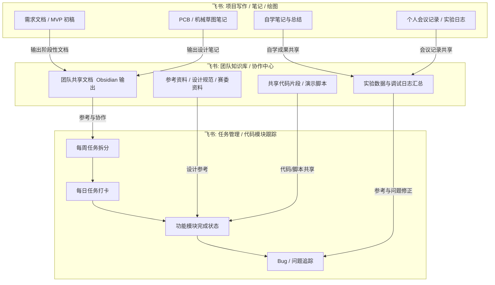

# 1. 整体难度

| 维度       | 难度评估  | 说明                                       |
| -------- | ----- | ---------------------------------------- |
| **硬件设计** | ★★☆☆☆ | 嘉立创EDA 提供现成设计工具和库，门槛低，但需要注意高速信号与电源完整性设计。 |
| **算法实现** | ★★★☆☆ | RDK 平台自带 200+ 算法，可调用，但需要做项目适配与调优。        |
| **机械实现** | ★★☆☆☆ | 可通过改造/复用现有设计，难度适中。                       |
| **系统集成** | ★★★★☆ | 需要跨学科调试与协调，是难点但也是最有价值的能力提升点。             |
| **赛事竞争** | ★★☆☆☆ | 属于新兴赛事，氪金和人脉壁垒少，中小团队机会大。                 |

# 2. 方向定型

## 2.1. 方向简述？

本项目旨在研发一套 **模块化AGV底盘移动操作臂系统（Mobile Manipulator System）**，通过将机械臂视作通用“操作单元”，实现其在不同移动平台上的快速接入与协同联动。在此基础上，进一步引入 **跨模态交互方式（BCI/MR/语义控制）**，探索人机协同的差异化创新应用。

与传统单一平台的视觉导航小车或固定机械臂不同，本方案强调 **模块化 + 可扩展性**：

- **模块化设计**：机械臂具备标准化接口，末端执行器（夹爪、吸盘等）支持快换；电路部分支持自动识别末端模块。
    
- **跨平台接入**：操作臂可接入不同移动底盘（如轮式小车、AGV 或桌面实验平台），实现“换平台/换任务”的快速切换。
    
- **跨模态交互**：用户通过脑机接口（BCI）或混合现实（MR）眼镜发出“换平台/换任务”指令；MR 提供空间增强反馈，实现更自然的人机交互。
    

项目在 **两个月周期** 内分为两个核心阶段：

1. **核心 Demo（80% 时间）**：实现视觉识别目标 → 移动平台定位 → 模块化机械臂执行抓取的完整流程，保证系统能稳定演示。
    
2. **创新探索（20% 时间）**：在 MVP 基础上加入差异化亮点，如跨模态交互触发任务切换、末端模块自动识别与快换接口，或在特定场景（物流分拣、教学演示等）中体现应用价值。
    

最终成果预期是一套既能跑通基础任务，又具备差异化亮点的 **模块化移动操作臂原型系统**。该系统不仅能展示机器人平台的灵活性与扩展性，还能凸显跨模态人机交互在未来人机协同中的潜力，为赛事评审提供新颖且具有实用价值的展示效果

## 2.2. 方向意义？

- **推动智能化服务落地**  
    模块化移动操作臂能在 **物流、医疗、教育、家庭服务** 等场景中发挥作用，解决劳动力不足或重复性劳动效率低的问题，助力产业智能化升级。
    
- **降低应用门槛，提升普及性**  
    通过模块化与可扩展设计，机器人可以按需配置功能，降低研发与使用成本，让更多中小型团队和机构也能使用智能机器人，从而促进智能制造和服务机器人在社会各层面的普及。
    
- **增强社会包容性与可及性**  
    在医疗康复或生活辅助场景中，移动操作臂可为 **老年人、残障人士** 提供日常抓取和搬运帮助，体现了科技的人文关怀与社会责任。
    
- **助力教育与人才培养**  
    该方向既是一个具体可实现的项目，又能作为教学平台，帮助学生和研究者快速理解并实践机器人系统的核心技术，提升 **未来社会所需的复合型人才培养能力**。

## 2.3. 方向创新？

该方向的创新在于将“移动平台 + 模块化机械臂+多模态控制”进行结合，形成一个可扩展、可重构的机器人系统。通过设计可快速插拔并自动识别的末端模块（如夹爪、吸盘），实现同一平台在不同任务间的快速切换，大幅提升机器人在多场景下的适应性。同时，在交互层面预留与 BCI/MR 的接口，探索跨模态的人机协作方式，为未来智能交互提供可拓展的验证路径。

## 2.4. 方向可行？

1. **机械可行性**
    
    - **现有条件**：实验室有 3D 打印机，D 成员负责机械设计，C 协助；能快速实现小型机械臂与夹爪打印。
        
    - **难点**：机械臂自由度过多会增加调试复杂度。
        
    - **可行路径**：选择 2~3 自由度的小臂，保证刚性和夹爪可靠性即可；模块化末端设计通过 **统一插拔接口** 实现，复杂度可控。
        
2. **电路可行性**
    
    - **现有条件**：A、B 均负责电路，实验室有老师可帮忙评审，PCB 一次打板成功概率高。
        
    - **难点**：电机驱动与电源干扰，模块识别电路需要简单可靠。
        
    - **可行路径**：前期使用商用驱动板或开发板验证功能 → 同步设计 PCB → 由老师审核后一次打板。模块识别电路可用 **电阻 ID / 插针短接** 等低门槛方案。
        
3. **算法可行性**
    
    - **现有条件**：B、C 负责算法，有一定基础但处于入门水平。
        
    - **难点**：视觉检测与空间定位精度、臂与底盘协同动作。
        
    - **可行路径**：从 **简单视觉（颜色/形状识别）+ 定点抓取** 起步，避免过度依赖复杂深度学习。C 负责像素到物理坐标的近场标定，B 实现轻量检测模型（YOLO-tiny / MobileNet）。保证演示效果优先，追求鲁棒性其次。
        
4. **统筹与集成可行性**
    
    - **现有条件**：C 作为统筹，能协调各部分任务进度，并确保系统集成按时完成。
        
    - **难点**：时间紧张，容易出现“机械、电路、算法不同步”的风险。
        
    - **可行路径**：采用 **MVP（最小可行产品）思路**，先实现单一场景（抓取方块并放置），再迭代优化与创新。确保任何阶段都有“能演示的成果”。
        
5. **创新点实现可行性**
    
    - **现有条件**：在“能跑通 Demo”后加入创新（模块化末端自动识别 / BCI 或 MR 简单交互）。
        
    - **难点**：时间有限，BCI/MR 深度实现困难。
        
    - **可行路径**：将创新聚焦在 **模块化末端识别与快速切换**，这是团队能力范围内能保证落地的亮点。BCI/MR 可作为加分性展示，用现成 EEG/MR 工具触发简单指令即可。
        

---

<b>表：项目可行性评估矩阵</b>

| 评估维度  | 可行性说明                                 | 主要难点                   | 缓解/可行策略                                  |
| ----- | ------------------------------------- | ---------------------- | ---------------------------------------- |
| 机械设计  | D 负责机械臂与末端模块设计，3D 打印可快速实现小臂及夹爪结构      | 自由度过多增加调试复杂度，末端模块接口标准化 | 控制在 2~3 自由度小臂，统一插拔接口，轻量化末端模块             |
| 电路设计  | A/B 负责，实验室有打板支持，一次打板成功率高              | 电机干扰、电源稳定性、模块识别电路实现    | 前期用开发板/商用板验证功能，模块识别用电阻 ID / 短接，PCB 审核后打板 |
| 算法设计  | B/C 负责，可实现颜色/形状检测或轻量 CNN 模型，像素→世界坐标转换 | 精度不足，底盘与臂协同复杂          | 使用简单视觉+定点抓取，先实现单场景 MVP，逐步优化闭环和 PID 调节    |
| 系统集成  | C 统筹，确保电路/机械/算法同步推进                   | 时间紧张，各模块不同步            | 采用 MVP 思路，先保证单一抓取-放置 Demo 可演示，再迭代创新      |
| 创新亮点  | `模块化`末端自动识别、跨模态交互预留接口                 | `BCI/MR 深度实现难度高`       | 聚焦模块化末端识别/快速切换，BCI/MR 作为加分性展示，先用简单触发指令验证 |
| 时间可控性 | 两个月周期可完成核心 Demo（80%）+ 创新亮点（20%）       | 阶段分配不均可能导致延误           | 明确每周目标和任务分工，优先保证核心功能，创新亮点可堆叠在基础完成后实现     |

<b>表：可供参考的竞赛</b>

| 项目类型                                    | 描述                        | 可参考内容                 |
| --------------------------------------- | ------------------------- | --------------------- |
| RoboCup@Home / RoboCup Logistics League | 移动机器人抓取和搬运任务，要求识别目标、抓取并放置 | 移动底盘控制、视觉识别、抓取策略、闭环调控 |
| IEEE RAS 工程挑战赛 / VEX Robotics           | 末端模块可替换的机械臂，快速任务切换        | 模块化末端设计、机械接口标准、快速切换方法 |
| 国内大学生创新竞赛（如智能制造类）                       | 小型移动机械臂抓取与分拣，结合视觉         | 机械设计、舵机控制、相机标定、简化算法实现 |

<b>表：可供参考的路线</b>

| 类型       | 参考设计                                  | 可借鉴点                                 |
| -------- | ------------------------------------- | ------------------------------------ |
| 模块化机械臂套件 | uArm Swift Pro, Dobot Magician        | 多 DOF 小臂，末端可快速更换夹爪/吸盘；机械轻量化设计；可扩展接口  |
| 移动底盘平台   | Husky UGV, TurtleBot                  | 电机驱动电路、轮式移动控制、ROS集成示例、USB/CSI摄像头接口   |
| 视觉识别算法   | MobileNet / YOLO-tiny / OpenCV颜色/形状检测 | 轻量模型实时运行，适合 SBC / MCU 平台；像素→世界坐标映射示例 |
| 控制与通信    | ROS + Python/C++ 控制示例                 | 底盘与机械臂协同、闭环控制逻辑参考                    |
| 模块识别电路   | 通过 ID 电阻或 I2C 识别末端模块                  | 简单、可靠、易于 PCB 集成                      |

# 3. 规划工作流

<b>图：三种工具的工作流</b>

