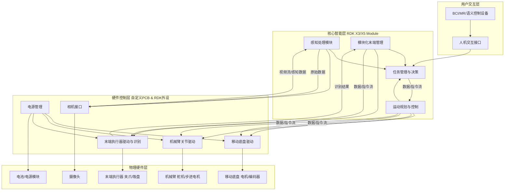
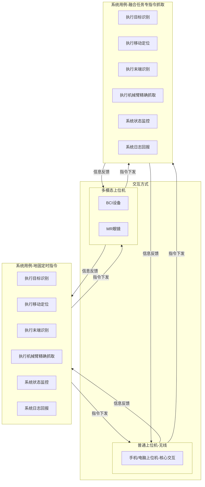
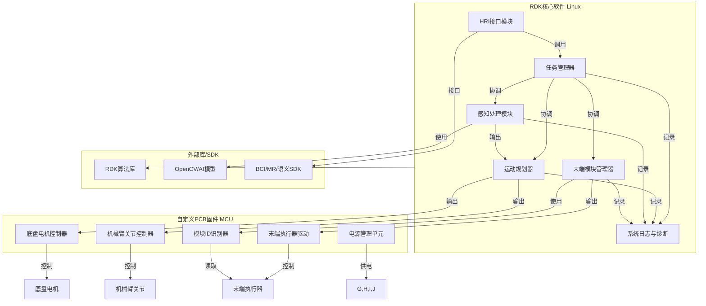
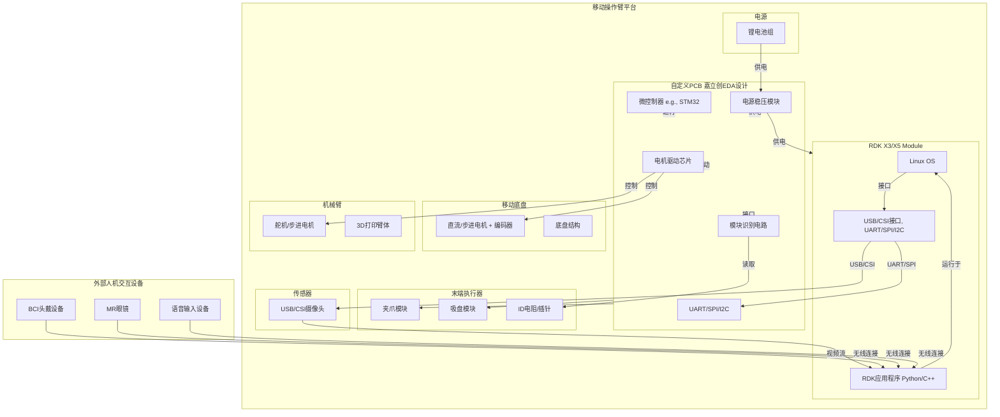
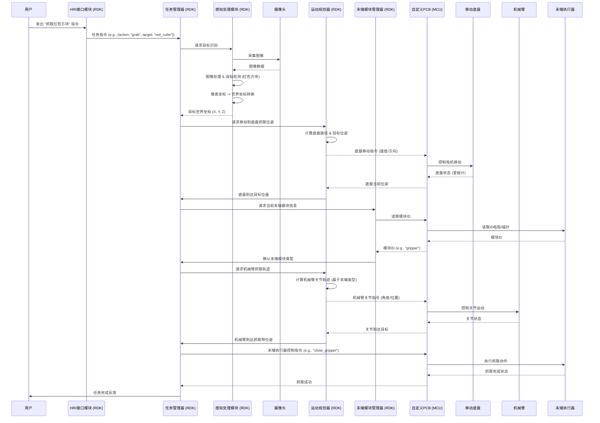

```mermaid
graph TD
    subgraph RDK_Project_Repo[RDK项目代码库]
        subgraph High_Level_Control[高层控制 Python]
            Task_Manager_Pkg[任务管理器包]
            Motion_Planner_Pkg[运动规划器包]
            Perception_Pkg[感知处理包]
            End_Effector_Mgr_Pkg[末端模块管理器包]
            HRI_Interface_Pkg[HRI接口包]
            Utils_Pkg[通用工具包]
        end

        subgraph Low_Level_Drivers[低层驱动 C++/Python]
            Camera_Driver[摄像头驱动]
            Serial_Comm_Driver[串口通信驱动]
            GPIO_Driver[GPIO驱动]
        end

        subgraph Config_Data[配置数据]
            Robot_Params[机器人参数 YAML/JSON]
            Task_Scripts[任务脚本 Python]
        end
    end

    subgraph Custom_PCB_Firmware_Repo[自定义PCB固件库]
        subgraph MCU_Firmware[MCU固件 C]
            Main_Loop[主循环]
            Motor_Control_Module[电机控制模块]
            Arm_Control_Module[机械臂控制模块]
            EE_Driver_Module[末端执行器驱动模块]
            ID_Read_Module[ID读取模块]
            UART_Driver[UART通信驱动]
            SPI_Driver[SPI通信驱动]
            ADC_Driver[ADC驱动]
            Timer_Driver[定时器驱动]
        end

        subgraph PCB_Design_Files[PCB设计文件 嘉立创EDA]
            Schematic[原理图文件]
            PCB_Layout[PCB布局文件]
            Component_Libs[元件库]
        end
    end

    subgraph Mechanical_Design_Repo[机械设计库]
        Arm_3D_Models[机械臂3D模型 STEP/STL]
        EE_3D_Models[末端执行器3D模型]
        Base_3D_Models[底盘3D模型]
        Assembly_Instructions[装配说明]
    end

    High_Level_Control --> Low_Level_Drivers
    High_Level_Control --> Config_Data
    MCU_Firmware --> PCB_Design_Files
```

---

excalidraw-plugin: parsed
tags: [excalidraw]

---
==⚠  Switch to EXCALIDRAW VIEW in the MORE OPTIONS menu of this document. ⚠== You can decompress Drawing data with the command palette: 'Decompress current Excalidraw file'. For more info check in plugin settings under 'Saving'


# 1

好的，根据您提供的项目说明和[[2.工学类/电气类/书籍总结/架构设计]]笔记中的指导，我将为您重新设计模块化移动操作臂系统的系统架构。这次设计将采用更结构化的方法，结合“4+1视图”的概念，从不同角度全面描述系统。

---

## 模块化移动操作臂系统：系统架构设计

本项目旨在研发一套**模块化移动操作臂系统**，强调**模块化、可扩展性**和**跨模态交互**。核心目标是在两个月内实现视觉识别、移动定位、机械臂抓取的完整流程，并探索创新亮点。

### 1. 概念架构概览 (Conceptual Architecture)

系统将RDK作为核心智能平台，自定义PCB作为硬件控制层，并集成机械、感知、移动、操作等物理组件，最终通过跨模态交互实现人机协同。



### 2. 架构视图详细设计

#### 2.1 场景视图 (Scenario View)

场景视图描述了系统的参与者与功能用例间的关系，反映系统的最终需求和交互设计。



**核心场景流程 (MVP) **:

1. 用户通过**手机/电脑上位机**发出“抓取目标”指令 (UC1)。
2. 系统执行目标识别 (UC3)，确定目标位置。
3. 系统执行移动定位 (UC4)，使底盘移动到抓取位置。
4. 系统自动识别当前末端模块 (UC6)。
5. 系统执行机械臂抓取 (UC5)。
6. 系统反馈抓取结果和状态 (UC8) 到**手机/电脑上位机**。
#### 2.2 逻辑视图 (Logical View)

逻辑视图描述系统软件功能拆解后的组件关系、组件约束和边界，反映系统整体组成与系统如何构建的过程。



**组件职责**:
*   **任务管理器**: 负责解析用户指令，调度整个任务流程，管理系统状态机。
*   **运动规划器**: 负责移动底盘的路径规划、避障（简化），以及机械臂的正逆运动学计算和轨迹生成。
*   **感知处理模块**: 负责图像采集、目标检测（颜色/形状识别或轻量CNN）、像素到物理坐标的转换。
*   **末端模块管理器**: 负责根据模块ID识别结果，加载对应末端执行器的控制参数和抓取策略。
*   **HRI接口模块**: 负责与BCI/MR/语义控制设备通信，解析用户输入。
*   **系统日志与诊断**: 记录系统运行状态、错误信息，便于调试和优化。
*   **底盘电机控制器 (MCU)**: 接收RDK指令，实现底盘电机的PID闭环控制。
*   **机械臂关节控制器 (MCU)**: 接收RDK指令，实现机械臂舵机/步进电机的精确控制。
*   **末端执行器驱动 (MCU)**: 接收RDK指令，控制夹爪/吸盘的开合。
*   **模块ID识别器 (MCU)**: 读取末端模块的电阻ID或插针短接状态，并将结果上报RDK。
*   **电源管理单元 (PCB)**: 负责系统各部分的稳压供电和保护。

#### 2.3 物理视图 (Deployment View)

物理视图描述系统软件到物理硬件的映射关系，反映出系统的组件是如何部署到一组可计算机器节点上。



#### 2.4 处理流程视图 (Process View)

处理流程视图描述系统软件组件之间的通信时序和数据流，反映系统的功能流程与数据流程。以下以“抓取目标”任务为例。



#### 2.5 开发视图 (Development View)

开发视图用于描述系统的模块划分和组成，以及细化到内部包的组成设计，服务于开发人员。



**开发语言与工具**:
*   **RDK**: Python (高层逻辑、算法适配), C++ (性能关键模块、RDK底层库)。
*   **MCU**: C语言 (固件开发)。
*   **PCB设计**: 嘉立创EDA。
*   **机械设计**: SolidWorks, Fusion 360等3D CAD软件。
*   **版本控制**: Git (GitHub/Gitee)。
*   **任务管理**: Pincode。
*   **知识管理**: Obsidian, ImaCopilot。

### 3. 技术架构 (Technical Architecture)

技术架构确定组成应用系统的实际运行组件、它们之间的关系以及部署策略。

*   **主控平台**: 地瓜机器人开发者套件 RDK X3/X5 Module (运行Linux操作系统)。
*   **低层控制器**: 自定义PCB上的微控制器 (MCU，如STM32系列)，负责实时、精确的硬件控制。
*   **视觉感知**:
    *   **硬件**: USB/CSI摄像头。
    *   **软件**: OpenCV库，RDK提供的轻量级AI模型 (YOLO-tiny/MobileNet) 进行目标检测。
*   **运动控制**:
    *   **移动底盘**: PID控制算法实现速度和位置闭环。
    *   **机械臂**: 舵机/步进电机控制，简单的正逆运动学解算。
*   **通信协议**:
    *   **RDK-MCU**: UART (指令/状态数据), SPI/I2C (传感器/模块ID读取)。
    *   **RDK-HRI设备**: Wi-Fi/蓝牙 (无线通信)。
    *   **RDK内部**: 进程间通信 (IPC) 或ROS (如果引入)。
*   **电源管理**: 自定义PCB集成DC-DC稳压模块、过流/欠压保护电路。
*   **模块化接口**:
    *   **机械**: 统一的物理插拔接口。
    *   **电气**: 电阻ID或插针短接方案，通过MCU的ADC/GPIO读取识别。
*   **开发环境**: RDK SDK，嘉立创EDA，GCC/Clang编译器，Python解释器。

### 4. 数据架构 (Data Architecture)

数据架构指导系统中的数据流、存储和管理。

*   **感知数据**:
    *   **图像数据**: 摄像头实时采集，RDK内存中处理。
    *   **编码器数据**: MCU实时采集，用于里程计和闭环控制，周期性上报RDK。
    *   **模块ID数据**: MCU实时读取，上报RDK。
*   **控制数据**:
    *   **任务指令**: HRI设备发送给RDK。
    *   **运动指令**: RDK发送给MCU (如目标速度、关节角度)。
    *   **反馈数据**: MCU上报RDK (如实际速度、关节位置、抓取状态)。
*   **配置数据**:
    *   **机器人参数**: 机械臂运动学参数、底盘物理参数、PID增益等，存储在RDK文件系统 (YAML/JSON)。
    *   **末端模块参数**: 不同末端执行器的抓取策略、尺寸、控制参数，存储在RDK文件系统。
*   **日志数据**: 系统运行日志、错误日志、调试信息，存储在RDK文件系统。

---


# 12

好的，根据您提供的项目说明和[[2.工学类/电气类/书籍总结/架构设计]]笔记中的指导，我将为您重新设计模块化移动操作臂系统的系统架构。这次设计将采用更结构化的方法，结合“4+1视图”的概念，从不同角度全面描述系统。

---

## 模块化移动操作臂系统：系统架构设计

本项目旨在研发一套**模块化移动操作臂系统**，强调**模块化、可扩展性**和**跨模态交互**。核心目标是在两个月内实现视觉识别、移动定位、机械臂抓取的完整流程，并探索创新亮点。

### 1. 概念架构概览 (Conceptual Architecture)

系统将RDK作为核心智能平台，自定义PCB作为硬件控制层，并集成机械、感知、移动、操作等物理组件，最终通过跨模态交互实现人机协同。

```mermaid
graph TD
    subgraph User_Interaction_Layer[用户交互层]
        A[BCI/MR/语义控制设备] --> B[人机交互接口]
    end

    subgraph Core_Intelligence_Layer[核心智能层 (RDK X3/X5 Module)]
        B --> C[任务管理与决策]
        D[感知处理模块] --> C
        E[模块化末端管理] --> C
        F[运动规划与控制] --> C
    end

    subgraph Hardware_Control_Layer[硬件控制层 (自定义PCB & RDK外设)]
        F --> G[移动底盘驱动]
        F --> H[机械臂关节驱动]
        E --> I[末端执行器驱动与识别]
        J[电源管理] --> G
        J --> H
        J --> I
        D --> K[相机接口]
    end

    subgraph Physical_Hardware_Layer[物理硬件层]
        G --> L[移动底盘 (电机/编码器)]
        H --> M[机械臂 (舵机/步进电机)]
        I --> N[末端执行器 (夹爪/吸盘)]
        K --> O[摄像头]
        J --> P[电池/电源模块]
    end

    C -- 数据/指令流 --> F
    F -- 数据/指令流 --> G
    F -- 数据/指令流 --> H
    E -- 数据/指令流 --> I
    D -- 原始数据 --> K
    K -- 视频流/感知数据 --> D
    I -- 识别结果 --> E
```

### 2. 架构视图详细设计

#### 2.1 场景视图 (Scenario View)

场景视图描述了系统的参与者与功能用例间的关系，反映系统的最终需求和交互设计。

```mermaid
graph TD
    subgraph Actors[参与者]
        User[用户 (操作员)]
        BCI[BCI设备]
        MR[MR眼镜]
        Semantic[语义控制系统]
    end

    subgraph System_Use_Cases[系统用例]
        UC1[触发任务指令]
        UC2[接收空间增强反馈]
        UC3[执行目标识别]
        UC4[执行移动定位]
        UC5[执行机械臂抓取]
        UC6[自动识别末端模块]
        UC7[快速切换末端模块]
        UC8[系统状态监控]
    end

    User -- 使用 --> BCI
    User -- 使用 --> MR
    User -- 使用 --> Semantic

    BCI -- 发送指令 --> UC1
    MR -- 发送指令 --> UC1
    Semantic -- 发送指令 --> UC1

    UC1 -- 包含 --> UC3
    UC1 -- 包含 --> UC4
    UC1 -- 包含 --> UC5
    UC1 -- 包含 --> UC6

    UC2 -- 提供给 --> User
    UC3 -- 结果 --> UC4
    UC4 -- 结果 --> UC5
    UC5 -- 结果 --> UC8
    UC6 -- 结果 --> UC5
    UC7 -- 触发 --> UC6
    UC8 -- 反馈 --> MR
```

**核心场景流程 (MVP)**:
1.  用户通过BCI/MR/语义控制发出“抓取目标”指令 (UC1)。
2.  系统执行目标识别 (UC3)，确定目标位置。
3.  系统执行移动定位 (UC4)，使底盘移动到抓取位置。
4.  系统自动识别当前末端模块 (UC6)。
5.  系统执行机械臂抓取 (UC5)。
6.  系统反馈抓取结果和状态 (UC8)，MR设备提供空间增强反馈 (UC2)。

#### 2.2 逻辑视图 (Logical View)

逻辑视图描述系统软件功能拆解后的组件关系、组件约束和边界，反映系统整体组成与系统如何构建的过程。

```mermaid
graph TD
    subgraph RDK_Core_Software[RDK核心软件 (Linux)]
        A[任务管理器]
        B[运动规划器]
        C[感知处理模块]
        D[末端模块管理器]
        E[HRI接口模块]
        F[系统日志与诊断]
    end

    subgraph Custom_PCB_Firmware[自定义PCB固件 (MCU)]
        G[底盘电机控制器]
        H[机械臂关节控制器]
        I[末端执行器驱动]
        J[模块ID识别器]
        K[电源管理单元]
    end

    subgraph External_Libraries[外部库/SDK]
        L[RDK算法库]
        M[OpenCV/AI模型]
        N[BCI/MR/语义SDK]
    end

    E -- 调用 --> A
    A -- 协调 --> B
    A -- 协调 --> C
    A -- 协调 --> D

    C -- 使用 --> M
    C -- 输出 --> B

    B -- 输出 --> G
    B -- 输出 --> H

    D -- 输出 --> I
    D -- 使用 --> J

    A -- 记录 --> F
    B -- 记录 --> F
    C -- 记录 --> F
    D -- 记录 --> F

    G -- 控制 --> L_Motors[底盘电机]
    H -- 控制 --> M_Arm_Joints[机械臂关节]
    I -- 控制 --> N_End_Effector[末端执行器]
    J -- 读取 --> N_End_Effector
    K -- 供电 --> G,H,I,J

    RDK_Core_Software -- 调用 --> L
    E -- 接口 --> N
```

**组件职责**:
*   **任务管理器**: 负责解析用户指令，调度整个任务流程，管理系统状态机。
*   **运动规划器**: 负责移动底盘的路径规划、避障（简化），以及机械臂的正逆运动学计算和轨迹生成。
*   **感知处理模块**: 负责图像采集、目标检测（颜色/形状识别或轻量CNN）、像素到物理坐标的转换。
*   **末端模块管理器**: 负责根据模块ID识别结果，加载对应末端执行器的控制参数和抓取策略。
*   **HRI接口模块**: 负责与BCI/MR/语义控制设备通信，解析用户输入。
*   **系统日志与诊断**: 记录系统运行状态、错误信息，便于调试和优化。
*   **底盘电机控制器 (MCU)**: 接收RDK指令，实现底盘电机的PID闭环控制。
*   **机械臂关节控制器 (MCU)**: 接收RDK指令，实现机械臂舵机/步进电机的精确控制。
*   **末端执行器驱动 (MCU)**: 接收RDK指令，控制夹爪/吸盘的开合。
*   **模块ID识别器 (MCU)**: 读取末端模块的电阻ID或插针短接状态，并将结果上报RDK。
*   **电源管理单元 (PCB)**: 负责系统各部分的稳压供电和保护。

#### 2.3 物理视图 (Deployment View)

物理视图描述系统软件到物理硬件的映射关系，反映出系统的组件是如何部署到一组可计算机器节点上。

```mermaid
graph TD
    subgraph Mobile_Manipulator_Platform[移动操作臂平台]
        subgraph RDK_Compute_Unit[RDK X3/X5 Module]
            RDK_OS[Linux OS]
            RDK_App[RDK应用程序 (Python/C++)]
            RDK_Peripherals[USB/CSI接口, UART/SPI/I2C]
        end

        subgraph Custom_Control_Board[自定义PCB (嘉立创EDA设计)]
            MCU[微控制器 (e.g., STM32)]
            Motor_Drivers[电机驱动芯片]
            Power_Regulators[电源稳压模块]
            Module_ID_Circuit[模块识别电路]
            Comm_Interfaces[UART/SPI/I2C]
        end

        subgraph Mobile_Base[移动底盘]
            Base_Motors[直流/步进电机 + 编码器]
            Chassis[底盘结构]
        end

        subgraph Robotic_Arm[机械臂]
            Arm_Servos[舵机/步进电机]
            Arm_Structure[3D打印臂体]
        end

        subgraph End_Effectors[末端执行器]
            Gripper[夹爪模块]
            Suction_Cup[吸盘模块]
            ID_Resistors[ID电阻/插针]
        end

        subgraph Sensors[传感器]
            Camera[USB/CSI摄像头]
        end

        subgraph Power_Supply[电源]
            Battery[锂电池组]
        end
    end

    subgraph External_HRI_Devices[外部人机交互设备]
        BCI_Device[BCI头戴设备]
        MR_Glasses[MR眼镜]
        Voice_Input[语音输入设备]
    end

    RDK_App -- 运行于 --> RDK_OS
    RDK_OS -- 接口 --> RDK_Peripherals

    RDK_Peripherals -- UART/SPI --> Comm_Interfaces
    MCU -- 运行 --> Custom_Control_Board
    Custom_Control_Board -- 驱动 --> Motor_Drivers
    Motor_Drivers -- 控制 --> Base_Motors
    Motor_Drivers -- 控制 --> Arm_Servos
    Custom_Control_Board -- 接口 --> Module_ID_Circuit
    Module_ID_Circuit -- 读取 --> ID_Resistors
    Custom_Control_Board -- 驱动 --> Gripper
    Custom_Control_Board -- 驱动 --> Suction_Cup

    RDK_Peripherals -- USB/CSI --> Camera
    Camera -- 视频流 --> RDK_App

    Battery -- 供电 --> Power_Regulators
    Power_Regulators -- 供电 --> RDK_Compute_Unit
    Power_Regulators -- 供电 --> Custom_Control_Board

    BCI_Device -- 无线连接 --> RDK_App
    MR_Glasses -- 无线连接 --> RDK_App
    Voice_Input -- 无线连接 --> RDK_App
```

#### 2.4 处理流程视图 (Process View)

处理流程视图描述系统软件组件之间的通信时序和数据流，反映系统的功能流程与数据流程。以下以“抓取目标”任务为例。


#### 2.5 开发视图 (Development View)

开发视图用于描述系统的模块划分和组成，以及细化到内部包的组成设计，服务于开发人员。

```mermaid
graph TD
    subgraph RDK_Project_Repo[RDK项目代码库]
        subgraph High_Level_Control[高层控制 (Python)]
            Task_Manager_Pkg[任务管理器包]
            Motion_Planner_Pkg[运动规划器包]
            Perception_Pkg[感知处理包]
            End_Effector_Mgr_Pkg[末端模块管理器包]
            HRI_Interface_Pkg[HRI接口包]
            Utils_Pkg[通用工具包]
        end

        subgraph Low_Level_Drivers[低层驱动 (C++/Python)]
            Camera_Driver[摄像头驱动]
            Serial_Comm_Driver[串口通信驱动]
            GPIO_Driver[GPIO驱动]
        end

        subgraph Config_Data[配置数据]
            Robot_Params[机器人参数 (YAML/JSON)]
            Task_Scripts[任务脚本 (Python)]
        end
    end

    subgraph Custom_PCB_Firmware_Repo[自定义PCB固件库]
        subgraph MCU_Firmware[MCU固件 (C)]
            Main_Loop[主循环]
            Motor_Control_Module[电机控制模块]
            Arm_Control_Module[机械臂控制模块]
            EE_Driver_Module[末端执行器驱动模块]
            ID_Read_Module[ID读取模块]
            UART_Driver[UART通信驱动]
            SPI_Driver[SPI通信驱动]
            ADC_Driver[ADC驱动]
            Timer_Driver[定时器驱动]
        end

        subgraph PCB_Design_Files[PCB设计文件 (嘉立创EDA)]
            Schematic[原理图文件]
            PCB_Layout[PCB布局文件]
            Component_Libs[元件库]
        end
    end

    subgraph Mechanical_Design_Repo[机械设计库]
        Arm_3D_Models[机械臂3D模型 (STEP/STL)]
        EE_3D_Models[末端执行器3D模型]
        Base_3D_Models[底盘3D模型]
        Assembly_Instructions[装配说明]
    end

    High_Level_Control --> Low_Level_Drivers
    High_Level_Control --> Config_Data
    MCU_Firmware --> PCB_Design_Files
```

**开发语言与工具**:
*   **RDK**: Python (高层逻辑、算法适配), C++ (性能关键模块、RDK底层库)。
*   **MCU**: C语言 (固件开发)。
*   **PCB设计**: 嘉立创EDA。
*   **机械设计**: SolidWorks, Fusion 360等3D CAD软件。
*   **版本控制**: Git (GitHub/Gitee)。
*   **任务管理**: Pincode。
*   **知识管理**: Obsidian, ImaCopilot。

### 3. 技术架构 (Technical Architecture)

技术架构确定组成应用系统的实际运行组件、它们之间的关系以及部署策略。

*   **主控平台**: 地瓜机器人开发者套件 RDK X3/X5 Module (运行Linux操作系统)。
*   **低层控制器**: 自定义PCB上的微控制器 (MCU，如STM32系列)，负责实时、精确的硬件控制。
*   **视觉感知**:
    *   **硬件**: USB/CSI摄像头。
    *   **软件**: OpenCV库，RDK提供的轻量级AI模型 (YOLO-tiny/MobileNet) 进行目标检测。
*   **运动控制**:
    *   **移动底盘**: PID控制算法实现速度和位置闭环。
    *   **机械臂**: 舵机/步进电机控制，简单的正逆运动学解算。
*   **通信协议**:
    *   **RDK-MCU**: UART (指令/状态数据), SPI/I2C (传感器/模块ID读取)。
    *   **RDK-HRI设备**: Wi-Fi/蓝牙 (无线通信)。
    *   **RDK内部**: 进程间通信 (IPC) 或ROS (如果引入)。
*   **电源管理**: 自定义PCB集成DC-DC稳压模块、过流/欠压保护电路。
*   **模块化接口**:
    *   **机械**: 统一的物理插拔接口。
    *   **电气**: 电阻ID或插针短接方案，通过MCU的ADC/GPIO读取识别。
*   **开发环境**: RDK SDK，嘉立创EDA，GCC/Clang编译器，Python解释器。

### 4. 数据架构 (Data Architecture)

数据架构指导系统中的数据流、存储和管理。

*   **感知数据**:
    *   **图像数据**: 摄像头实时采集，RDK内存中处理。
    *   **编码器数据**: MCU实时采集，用于里程计和闭环控制，周期性上报RDK。
    *   **模块ID数据**: MCU实时读取，上报RDK。
*   **控制数据**:
    *   **任务指令**: HRI设备发送给RDK。
    *   **运动指令**: RDK发送给MCU (如目标速度、关节角度)。
    *   **反馈数据**: MCU上报RDK (如实际速度、关节位置、抓取状态)。
*   **配置数据**:
    *   **机器人参数**: 机械臂运动学参数、底盘物理参数、PID增益等，存储在RDK文件系统 (YAML/JSON)。
    *   **末端模块参数**: 不同末端执行器的抓取策略、尺寸、控制参数，存储在RDK文件系统。
*   **日志数据**: 系统运行日志、错误日志、调试信息，存储在RDK文件系统。

---

这个重新设计的架构提供了更清晰的层次划分和组件职责，并结合了项目说明中的具体要求和团队能力。通过遵循这些视图，团队可以更好地理解系统，并有效地进行开发和集成。

#### Sources:

- [[项目简介]]
- [[8.生活类/日记类/2025]]
- [[STA 招新脚本]]
- [[2025.6.x]]
- [[2025.9.4 各组长加快写作组员培训路线]]
- [[7.项目类/商业类/表格姬/系统问题/2025.8.x]]
- [[Web3 科普]]
- [[注册 GitHub]]

# Excalidraw Data

## Text Elements
多模态上位机 ^24g2fLFU

普通上位机（无线） ^Ts5Kwly2

手机/电脑上位机-核心交互 ^9tS5Jehj

+ ^rPdLeNjb

指令下发 ^EGKzkTbu

信息反馈 ^8ukr2bhI

指令下发 ^dS6uRD08

信息反馈 ^zvJ2a4P8

实现优先级：红色框为第一目标实现、绿色+红色框为第二目标实现、红色+绿色+蓝色框为第三目标实现 ^aWiizTv6

信息反馈 ^2FjlyqAm

指令下发 ^4Mj8V7T9

信息反馈 ^zxpGw7KW

指令下发 ^KUgSYUFk

BCI设备 ^PQ4DUjy0

MR眼镜 ^VjUg7bSd

系统用例 ^oeMSkGfA

触发任务指令抓取 ^ZxOCWunT

陌生环境
常见重建 ^SA4BpoMQ

陌生环境
路径规划 ^0J3PwcLD

机械臂抓取规划 ^rjQSxajB

抓取物品
末端识别 ^gjWn5cow

系统状态监控 ^mlPbEEny

系统日志回报 ^RcPsqM1G

系统用例 ^qrN98OU3

地图自主搬运 ^EslrmuMq

自然语言处理 ^zlSc3Jpw

执行移动定位 ^4zPlywpA

执行机械臂抓取 ^U5yOHQiR

执行末端识别 ^VkpiK3aC

系统状态监控 ^gasTQDiv

系统日志回报 ^9TcXkTXK

执行搬运装卸 ^uWpPJLN6

语言指令 ^qRxemQrJ

%%
## Drawing
```compressed-json
N4KAkARALgngDgUwgLgAQQQDwMYEMA2AlgCYBOuA7hADTgQBuCpAzoQPYB2KqATLZMzYBXUtiRoIACyhQ4zZAHoFAc0JRJQgEYA6bGwC2CgF7N6hbEcK4OCtptbErHALRY8RMpWdx8Q1TdIEfARcZgRmBShcZQUebQBGADYEmjoghH0EDihmbgBtcDBQMBKIEm4IYjYjRIAGOAoANSMAfQBZAA0AMQB2ZwAZAGUAZlIACQAVVJLIWEQKwOwojmVg

6dLMbmd44fja7QAOePieWoAWRIO6nkT+UphuAFYensP4q8TPg9rhgE4ru6QCgkdRPM6PbTgqGPa6PI49QFSBCEZTSbjveJvb49Wq/Wq436fM6I6yrcSoWqI5hQUhsADWCAAwmx8GxSBUAMTxBDc7nrSCaXDYOnKWlCDjEZms9kSGnWZhwXCBbL8iAAM0I+Hwg1gawkgg8quptIZAHUQZJuHxCgIafSEDqYHr0AbyoixaiOOFcmh4oi2IrsGoHr78

YjRcI4ABJYg+1AFGaQACOyh6AClaknhpIePoAEIIbAAVQAInBSEXcI1CBAbQBdRFq8iZGPcDhCLWIwgSrAVXC1VViiVe5hx4ozaDwcnDG0AXypCAQxHRj3ej1+ux6w0RjBY7C4aDhjx3TFYnAAcpwxOjhjwXjtaj0/TayswS+koEvuGqCGFEZphAlABRYJMmyOMExmccJ3KCRhgAaSjUhCEZABBRlCAABWGYgOEZOlhlNTRBgQA5+VKOZyQgJVaS

oG0wHnejoNKWD0DOTBS30IRiCMZwoCENpTQAcSMCgoAAJSTHFyNmKc+1IWja0TRjE2YyBWIgM5akkFooDTNgRjaZhhjTMZTQQITNHEoCAE0ZMneYJBotg6OUwEino9TlwkHh4LTIwAHlalNHojCA4ZzAQU07DTbA80eezKPkxT6NnetESEOBiFwT9vNQeIemuHozh4A4eHeW4XyIDg6TbDt8ERVlhS/NAf3wMJChUjyYLyiAeDOZQeDVfouiLVUk

tlLAoFVTY0G2XEDm0WoDj+W8TkSYZEh6Y8XxDVB10W4Yjl+Z4zl+cqrm3F9gWIUFfVORFJGRVFprQHgdonUlnUpF9jXtKU2U5XkeSQf8hRFIdJRZQHZXIDgFSVLJpsbTVtV1KjXWXKk7TNC0rWxk0HXRipMcHYRPW9dF/UDYN0TDF8I0ymMIPoiAU3TTNs1zAtizLCsqxrdKXybXAWzy9tOxfbtiF7Jz4jJ8VcMptAJYa37Fzy8qklvI6eF+E890

4bhwQOA2zw4S8OGvQ9hhhddb31qW3w/FrUDav8XwAxWQIyJGIIbF9Muy3L0UK2o7xKsqKsa7tapV+rGrYZq8vdhBEU/TBXvQQAsTUAQitAEADQAoOUAWXlAC5zQdKAmKaKjzouy9VNVOCgQZCCMckHuFpuulFzU9o+iiptQohlAPdBgjVZGX13KBzAIIeUVH6AA1VPRslwbsmFbePJYnNkUW7Agq8zmuC5L8uSSEKA2HE8JW/JGkhDTqqN7GZ60V

9bR3s6u5oLKXr4iLDwMY2AApwB6EmX4ygAp0iMFGDIXQSyYHPONOSEhFjLDJDNLYOJ9i23XKuG4zwbiVQnH3Lc2hHjhzOAcLc8QzhnCSCQ0oN07r7XBJCR40JYTwkem/LOGIsSPlxPiX4hJEjEhfF9ckP0Jx/QZADGU6AuQgz5GDYUjMJQKIqHKeGiplSTwnBqLUjpnQQFJgTe05pbqWjehYhkJiMYsjdC+D0kgRxxmfLvGmsA6YyNKIzaMsZ8is

3ZhmLMOZ8yFlLOWSs1YlIlADoY5sCAt6oFVl2Hss10C4B4ArYcytUDMQctOOcC5XaJHeqdYqnjSi7nNtwF4/dIB1P3Jba2+U9grWoTwP4XZnbBBDq1X8T8Jxe2AqBP2wTVKeT/hURILRiD9FQgAKyAo0BhXQ0zngQGMKMKxhifkSqg7JCkXLxJKF1EoalZkSE0AARXPNgICjIxjLPBMwFoiRnCEGcHc+IjQWgPHcrJRyJyUpuSYjMjS8FlniX6PE

NoeZTRJlMLUKMRh+hqkGEWBAjQSxHNBdRU5rkZiXO6omG56Bzz6AOB0bAiRTQ2QmMoNM+gkxGGwAALTTGqRIjxcAEqos5ElFyhYTiDjlV2BUiqRwukwyA1U45pITlVJODIU7DO/oUX+GkJjMEePBCg+AYC5PTsc6A1dERZOcGcF42gKlXB6EcLSRDER93+NoI68QTpbj1pwhhiIWE2Pyt8XhKJ368CadRFY307FMmhooiAyjgaqkFOoyGWjYbyj0

UjBuqMHEkycVjX6OMop41sSWwmBb9RFoVhTUcVMXwBiFLTUMfjIABOZlMicoTOYRJ5tE/mcSxWlBFmLOqO8WKZL7MMPJSsG3bzVrIjWDT3jUOOAiKep59xPAOFGlpF4rzknhD0Hg5VwR9PfAM12qd/yAWID7MCOR8iJNKBKwZ+Uw4R1KnKmONUJ1LtKE1dV35hnp2rhIQAdmaACwEs+gAIf8AAemgB+v0AJD/FcKBHyzhAGD8HkNocbE3FubcrTt

vVF3HuxqnjgczvPEeFRx4GNqUwGe7haOLyvnAFeTd15elIKk9JTbkL+EPhB9AOGy6IdQ6qXAl9r632I2gB+IygMvz4eiT+jwtVXKlr1FocB4j0FkHmUgXRHicrYAFPM/Q4DKGcEBbAqEUGEvQVIrBc04TDG0C8K4NDEjepxAcU2u1uDiLONoX4LwcT9VqCcF4EiJxBu4LsOIwx8QxZWnsThiRHYTieuGrOtqKEkhjdIuNmalHA1UZ7cGGiobSm0X

DBG+i83GOJjWw0carGsOtLI0t1aXS1vdOTNxBSamQGbUGHxbbwxikCSzClvbwncyiXzWJgsZivsgGOlJ4sVUwWnU5M4c73EAbKXlS4WkNwRauhOA9o9ng3aY4bC2R6VxJC1rUR4UbCD9IQB+29nt72PsmWgSC2nEwgqohnRjPUKi/Gbo8NMCBJDLPOQxEdkB31Sq/cVH90dn7/sXYnZOoH2oIC0+SrycOEdI5R05qHlqXzWs4a8YY1CiQlQ2mdeL

9wQswk/neKLWlYvFUDeW3gfxIR/Ai96npZUjg9dKHll6Voo2ubQKRuR8b6sSGTSDVNNWM0Joa9mxGKoUatadI4jrlbLHi8V7aKtbWBs24nK4k7vpqYtqm/lemE5O1BNByE1MYSuaRN5jEgW5zNvqmSfxvbU6ZZZOoglIbisPfKsnQIFdvphjDG2pQnEOWnv1MPE+M2rTXtoA2ptUqDDN0wV+/9sDgPvYTPAi+jKWVJV5WleHXHUcAQE6VQJicwGb

0t4nNDiogBpI1LgoQArK6AERAs+zhAAcFoAYf1AAlcoAJLl0OYdn/P5fq/N+74boRu+JGCPZG7voXuVGXzQ7YxUMQ2QmCqmnrPfAz+JB3+IMQNYREVeKIDePjXTfTQzOAYzUzczSzazWzezRzf0ITA+fAA/CQOfRfFfMudfbfPfC+K+G+VgBTVAJTP9HZNTD+L+C5H+HTBYTCRZBAc8ZZTQenbRRnCca1PYdhI4XELSd6EqZaeVCAPaDaZIRpWXB

hLSCpMbCARLN6V4e8f4HoX4eIShP4WoCpMNFXQ8CEThThGhFaLcOEM4R7SAdXCkMrY3XXSrUGardNe9craARrHNc3YWfNZ3MxQbW3XGaxfGHwomK3QtV3Uod3UbL3SbPaPYUjAPebHtEPPtZbCPIddbBJRsOPXbLPMoA7bJRIY7ApUfUoMIV2U4HEW8baXECvI2Q8G4Kol7K2ckOhNQ04cqVQy9F2DVMnO9NvX2DvUHGPLHXvHHWVfHMfWOU7VVE

nIZLox/UTCAAAan3zmMWOv2bkvzQHoSlw2jxBuH+EdR5y23Izv0o0PGoygB/zHgQAng/2Yy/wuKXk4yAO41APjyyL3mEzQOWOk1kyIPWLdknxUy9Ffny3U2oIYloNhzgkQmQjQgwmwlwnwkImIlIjYKcmJTc1QG2DoVwRhH+DoS3Ai36jdQaXEXtU2i3G2iOD+EeAdzkPF1+CWl+G5xxAKlPXOjKgQG2DMKRBBN9DUMhDPUoXOgqO2O5IsM11LSc

L1yq1GUN0cOsPQB0Sa1zQtzRiCPa2cV60Ji62DVpK1360qDYBkC/DT3rQ8QiNbV9xiNmy7SDwWwSKW3D0HTW2j3SNFh2wmP2yTz7B6HyIXUz0A2zylR6RFxkLqPRB2GL2aW3UPQaNDhZPeEC1kJ+yvT+wnxmNGSB3b2fTtKghmQmkVI4IpQ0iAiEngiMDpAmE0CEDRzSg2y72DmxxlTxyHzGMJwDOJxA2mI9gnDgDYG7BzPjHojBxKHbVHPok2zA

BHLAGcAZL4KZJZJeD1h/U5J2GBWOAhBKnelxDvEoVFInIxwgHwFCCgGZH0Dv2NOIEwn7JVCJxLSVCgDzGlm7GUG4CKXSCfVSUNJqHqCaFaE6F6AGBGHGCmHcjI2wCEDjFwQqJiwxFPU4TvAdw7VwE41ONZg1EwCXGvIHO7RmFwRODOiZNxB2FPSuDGxKExH70oXxCSBeAqTZ000TDrFKRfCyGICfIlBfLfNZg/KRi/OYCMAOEaDGDuTuUZDuTaHw

CjDTDuU5WGDYCEhskaDsjAsbggrjGcH2BxELzZz3ThHOBpKQogGUBQuNnC1EQssstEWESaS20IEwqvJvKzmnP2HxIuFvCIVxBeFWmBU0qWkYXZNtWOG+BhBOAPNJWxgfNQmJSelwEyMDIwAlGitolit6mFVVCCAAgoFdjIPcIcpImUCfTjEKNtAfKjGYEGEQCDAIE9NKDYvKsqsLCsHwAAwpx1V6lLPLMrOrNRMLOPitS2GCpxOy2dQJNIuJLQG+

AZIOFtVETPXeGFNpPkNQFDRfGVwjXemK0wQ1ysJ1wqxUTsNlIcMVicKVNcJh3VA8PVJd01KKNLR1P8K1PtANKqEvLrRG39NkIm0tOiJm0jFtKHPtI5kdIHVWyj0PO21eISulllmyTIjT3yX9JKrMRz3ynoU0PRv3RjNHgKlkLuzaUaIdmCti3aOvU6J7NKDGQfWzP9gbJ71DmbMH2EMVVqoVTVXTIptmDmMAHBjQAE7lABoOUAEXlJY4+CQPmoW8

/bIIjduUjRuG/CjPuM4+41/T8dkA2FjOeYeReP/AAw60oYAnjTeXqBCJCFCdCLCHCPCAiIiEieGwTfeDgETUW9AcW4WgguTYg++UgR+cg4EnQ/KDTNqugiQdiTibiXifiQSESMSSSaSM1QldKgauaDcTzQiwqQLeiz4Cala74JadcfqS4GEcENo66ekxk5kmLJc9kngVc7k9a/hfkrcoU3czQnyyRErbgCUwmKU2wg3Y6zRBU5w03ZrVUg08xAIh

6itJ6+xTw16kOU0j680ptbxKIv3fxG0wPQG+I4GsPUGyPYdes4WDI1m7I70pyX4P04qhPIMzWL7H4C4NcrdZ7CM9cOogm0OGhAi+vUmtM8m5TAULM3owckc65Asi1fqqFXqA4IQOkUgHgTQSQKMWsw8wYhm/vEY1swEkfa+o89mv+xEPsgcuIkoFy4FWoCc9yacucpkhcyutklcrk3yjcgU7c4Uvc1acKtIqqE8s8i83KbC28js+80gR858lYbii

lXi7IfiwS4S0S8SyS6S2S+SxS5S8icCyCrYXBIKvzPYapSkr7Wy4y0yjY8yqyqymy1S+yrCpy3C0cz1G4BhJki4PWE4R8JCmc/YGLT4QKp8d4T7PzHgTh8E1iiUDixwcRtAd87Mr8qoH8hoZodoboPoIYUYSYdRtSzRuaXBLpbaRx3YE4Z1MCky1C/aKxhygR5yzyfYbLAqfPDacqL7cRY4dcpaFumiraQqHpcEYJy5MxKIER5KlyVKk+tioZigE

ZtExSRETKlyHK72/+y6/KhAQqkHIR3rMqiqqq5q0ZiUBq7ZmqxdIOyE9AaB2B+BxB3q8Bi661a7SEURdOq4HpPlKNPaKaw4Wa86C6RasXPwya0jeu1XLa2NAInug6vuiGeUvaoe3RM3C6oxNU0xce6estP53gONF6o0+elxYbDPL6le3xP6pmTekctmB03elbfe1IsAGPSG+KjJM+7JJAnF9PAonB4o3vW2ahPPM6bku7UOPl7G9+30K4YuuvBvF

iJvDmxZqm4HPo+MAY7vD9Pvb9Jmv9bBrI8ffB2Y52iAQAQ/lAB7A0AFnlQACMyRasNDXTXJa1iSCO5DEjj780Kp9B4taX8kZ391a7jXXf8SBdauM14XjepQ6SwuIeI+IBJhJRIJIpIBxkCHanaLXjWzX3bfiSDcq2yKDeSA6wSup2q5kFkllVl1l4hNltldl9lDl46hV0Sk7MSLhkhHx1onxAt3pMHIA9ow4HHPs4RGmGE89fnWFMQdhLhLh89T0

kgkgfha7tCI1jgGStwfNRXuC4QgtPoO6drQXB7pS9aBQ5STrB6zq4WWtEXrdbrHc7c0W9S+tZ6sWTSWWzTG0vFvdV7rT/qSXg8d7+1KWUjXSj73SoaGXYbqI8xL6T6OXuAaF6ncaJXozn6+S4Q36q9UBOdPh3o/Mf7m8MzKbAGiq7HQHzVp9gVKVKhBhEghBxISxlpkHD7xUlWmz0GWzmbxi7yx88HSdOaIBCH5WRzSHqmKHhzPJtgEhNofMx3yo

/M6hhhp3PI52vMjpLgl2DLAtgmY9jzqReG1B+HbGWO7qHzwmuKomeKYn/5AFgFQFwFIFoFYF4FEFkFVKk4smKQEhLtQq4Q/Nng6gaTimTGyn0LrHHKcLcy8KBSTpWjThsstZzpWmqK0taKumGLemZmwmxHXzDPJHjOSZZGRKxKJKpKZK5KFKlKVL0KHOoLIQJP0tSoypvLw5vPSmwtzHzHLG/OKntOt7gutxloRE6E+2rgvPBOvGArxWhrQqgmmK

WKNnBmYqQh6XQniBxnJmwUzkZn8Asr5mfa8qlwCrcOdPSqRH9mmrDn1m6q9mtnDuWqjmaDtVg70BiBSPyPKO7ap8COizIBmdNClonwbhm2yo4QYORCIPHx7UDhrL3pbYNwtDS60XVrctKDI1gXStN3oXt2IXatTqXCj3R7PDkW7rtT7cMWb23qF68WLSfdfqGYN7iHkxyWv3kiXSIbj7dvT6gPcBGRQOmfwPq8U7tyXhwzfQNpEO4zQxrgIs/GMP

pXujxkgHabA46OhjGbf1h8T6tX2PFnp8xaBa3aXFK4ebNfrXpar9O55bjjFadXzjvX0AVaPWn6Nbv8LeIAdbACXwDbA383FkVk1kNktkdk9llADkd2IB3jUD0CXa9eU35MvaNuM2/bZ3A6rvwcWJep7lHlnlXl3lPlvlfl/lAUrnE6mctgPL7n/gfgCT1wnUDiAfJrc7PtzoLg91xF1xZDlqAW4fZOF2FPmmlPV3ShxTdqYZ9qU01FIX93oXD2R7

3DLckXvCUXJ70WAjMWif73F7H3Shvqye16O1Ke7GyXP2kjnTwaaPR1Gfjv1IcjqJ8UEb50r6sjOfeA6FUOGECo+eOlKFBf2k+VUt+oQf/uUyOjVfJfqa0vPDvmRe4QMIcxHIwPQDTA8BcAZwTCGRFSgoM5eaDVVorzbIasEqKvbsosy47AMBOEOMcmAHIZMVKG1TJht6jk6LtO+JsA4Cp0ag8MDAfDGxoFxP79M9OKXCRhOCkZQAZGQlbLgozy7K

NCuajezupU7peZzgZULSKlmsoRZNCdXMyo1wsZ4gjGGFZgYIxcqHAaSDCU4GoTOgGF+uEOPyt4wi4zU/GIVQJolzm76dImhSIzkAy/IAIgEICMBBAigQwI4E+gBBEggyalctGnqYqLagELds/Mn2BQU60MT+dKmdjIgcD1PS14osTqT7Pnmi7tNvGdFbpoxQ2wTddOU3FKjN12bzdpucVZKMt1Yqrc5meUdNqOn87bc1myNakJs0arVULurA+qmd

xaGtV4+lOCAVAJgFwCnuFEUATcwL58oi+3wfPNSQiwzVs62IYHqD0eDg9a8A7YNDDyVxw9Nq7dbapYSR798k0vdIfmjwPYY9x+kQyfqe2LQz98e8/Qntizdy4twiy9Z9oSwp5vsqeO/UPLT334H0uGSSf9rNy9Is8gI7PVgbf1OC189KIPZ/trDf6E1REJ6UwuL21aZkeiO3BVnTWVbDFGO6rZXmx2wFnEKglrZNtrwwxzEiR+vP4na1HQOsTivn

Z1jRnt5W81aNvL1gvAqCO8A+LvXjF+WT5PIXkbyR4B8i+Q/I/kAKIFPbQ+Ih99WSbb4oQQj7cBqhCqVTFm0xA5sISifdkUWCgDxBUIqEDiGqFNCDB4g9gVCPBDVA2QgIhAVglW3owbwMSzgJ8MkDxA/BTgqWGEJcFpJ9wLgFCc6M0WeahZuSy1cRK8EsoqE+UzJbvpAEBamMWctqW2MtFFbNNpOa7bYV3X+hbshovwBAPQlR5G5R+JwlUhPxPbBE

z2/TPHpewJ7XVDSi/e4X4GX6e4nhkRF4f7i35Bdqeu/J0mDR+E0s3S46JnjDWTy4AugIIopAWTG7dCb6gPR8IsOuzP9P+sIq0OyQmHclf+ZNf/q3il5oi8girRsvLwY5qsleTPLAf8Sw6QBcBVPXjgQP46JhpyzgYMWYwiyEhOEC5SMSUDCyxjjCCY8REmK5J0DuG6nRgZp3UFZwGhAzURpxVsHI02KNg1LqCLAkLcChTPMZsUIBGlA+yxqZQNUR

PEdRuhebW5DwA6BtAxg8QISKhCgDLIOgaoDgBQDuSYQ8w3eAVDaIkDVQA+XBTaMkEWHRYWSuwW8LMNtjhZKk9bT7DsADRQ9WELfLNqVAhB5488iwraCtD3T/de+uwxNByEzHZijshwvMXsLH6FizhxYjUpcNx4XtuslY0xHPTva1iH2DYp9k2OmyvDiW7wxbBSzp4H9fhR/f4SfQHF9ghII41mGOJyGTjfQBJTQnCDxrY0rQKhBcWgGbZaRu2UZV

8KmUw4cdZWNNTvLL13EoCB8aArBriKmLYScBTlC8WQL44kD8BiYQgc4CkmeoZJckp1EdGeB/ix8DA88kBIC6CNQJ7AiCbBKgnJdupYHeCShMKEISShTPdCTAEwmjxU4xzDURIDgBGAkwCAGFP0CMBGAiwNJKAIVSEgmQ2ANkNgFcxYn2jh2yQHpLbGOBnpNoKQ4LLoU8ytsjgIPH4KljbZ0k0W7421HGMoQZ0LgDCZMesKza6x7UnwPlNiSdS88t

hILFFj3RlzYBTU9hYfgPXzHD09JNQ84SWKMnntfCpkm4VWIsnoyIAYRT6qTxfZEs5s2/ZyV8K7HUtaWx/ZGt5KchjA/JFKAKRFXViuwQeZ0G4EYWf4F1opqANnMVDwR7okR64lEZuLWbbiMR9HVAaMVylHi8RBUghkVLsaXiKp14mYLeLenFRPxX0n8Y/SMEAygZwMrSKDJ6BNSgMLUpge1JAnsswJMEwoXbI56DT8ho0toUlSGljSWQE0rCdNNw

k3cIA4kNgKhDgDiQOAcALoIVTGDiR6AzgNoPoEsBFhGQLQA6XaNrZclLgXbHYHpVUILls6uNLzM8zdGxYHwFfZarFjCxCFgxlwTQriCjTRidhKYiGcZPkRbt/M8QGGbmKhY6SCxbhfSWPWn5NzUWWMlFgvzuGhEHhhMxsT9Q37GVWx7XdsZ8L36Uzf2fwvsawLpnZIkGl/DPKOOOTjiQmy6cpNQmzleo5xnCXmcOzzzawfgws/ERuMAFbidx9NYK

QrxllKj2yyNY8QDl7JKy2xKsvCmrJIYycI4S0D4Lairl1AToZDM2QqgtltTohjsrqREx6k4NoJHAhBXkOGaITXZRQ52ahLPGezJpqvGaVTgkCcp+gUYYYMoGWTOAhA9AfoI0CAjwQSwjQNUGMCECDBTAycr0PaNEQUJPgA+TcLiGyzZ076Po89OF0f7PAVhndGdlnC9Q1TL5esFtgrjVzrt65A8qGU+HblaTO5iaXST3JRkGSbqeMrXLPyvZO4cZ

t7PGQTKXq2Sp5r7RyWTJp6LyqWy8jyavNpln9cAaYRmc91BR7y+mYI/EDNRixwgEp/LN6DCHPnNFbYpUGLDfIVl3y5WwDR+ZiJfnPSWacs/KV/LQk/y55f88cmVJvElT9ZRwBRclj2KlQTgWQhJIeTU6nlAJl5eBXBMQUGdsFDslpRgomZYLepOCzBS7ORrjTCF2A4hcR1wDmhW4EwegHkSYl9URhc0DdHEE+DrgmSSQShKYU9HohXGfCjcKeifB

4gNo/3ZaqoTrobDVFqYvvqpIOFwyjhiM2FqcMMV9yQiGMwebqTMlURcZ71EnpPPX4OLSZbYj4YkU7GuKGenk/sV4vgggiGhqNCRf8C0hCyn6pePmYSGiX4g6gfKbaAkpyUANUR4s1JVLOymvyjyzHVgZ/IBJc1dWgAPO1AADc6AAMeUAASioAHK/QAFj/gAIr9AATkGAAxC0ABccoABpvQAABygAO7dAA4BY0rAAgAyAB/v3ZXzEOVPK3lYABi5E

VeKo5XzEpV8xQALshXKvlYAEg5JVdSvNYVAaVDKllbKr5VCrRV1KyVdKtNUKq9VYqlVWqs1VyrdVFqikba1lo0jTe9I83myOYlXELqn+VjPbw4z+sQC3IvBYHxQKO1PiVKulUyrZVaqBVdqtVTasVUWr7V0qx1YmpdU0rZRHtP4oqOJVAlW+cffeT0I0haQdIekAyMMCMgmQzIFkKyLZFz41t8+CyuhClm+BiEzojqPWbzkPB7B7UBePJkkGL5LV

xcmIPzOCA8qhLRelCWuXDwqTOcZB9/NnAVA3AI8ZFKkoGOCx0Uj8u5SMgxXZVRmGSjQ91a4cPNuGWSx5dY75XYt+UkyAapLcmS4p/agqPFODdedRH6BQr2WqNXYPWzPTodEVO6MvOFOezCtUATqXQdSRXFStkR2HXFdx0hTgCwGhHSBhUB4BdBlkxqJMKhH0DUd3JmOZAc/P3E5S35GAzshLxfDnjlZJS1WUUvVn0aZguwT7noIewFRiKG4ABVOR

k72o6EnEyhGoTnVhDPIrGxtvoVoRF5vUM4RjYAohyTqBNM64TY0lE0Q4l1dCFde5Xrzcbxuh/GBQBNalNK2unUkRh0uiYODeojIWoPQBqglghI8QNUAFCTD0ASwiKICMoHghtBfgzIilJkzK4BZToIPRMhUm/qswSmD+PzVELa6aCBNX3L7C6kuBRS+NJg3xiNxoRWCuBfUpBZwLqoZcJAcTOoAk3/LJMgKaTUCiVzEHZMAhfKGLHrEKimFPs20e

VMhVKYQg0sHWzreCFUHRaWBmggpsVA3CrgCoZgyogNzaYwV0h8XbLLpuyEszJu5xd2dgpGlpVW1XAiodlSqELMUYyzVZvK1M08COhOzJCad2aHHaAyoyjSFhpw0wA8NBG2ZdcyOkCIHs+eKhKDKJLXT9oesT+EFXBHs52Z0i/5rIqBbgzEekMlubupuXaS9F3c+FldSn7PKyxJkt5djPMlWKvljw+9cTIcn/K55gKkGt+3p76bY8YKteV4raC/qb

+qNDdKYX+CdNoRAvEDbGXaSxZCQjbBKauN/oizENYs7jvir3HSyMlJKj+fLOxWPaJA5I90Dr11aS6jeNrGWqsVvyOs6RA8Bkb6st7utfNT2W3vcQ5GhrDaYBCoJWt0j6RDIxkUyOZEsjWRiuu8KNQm0JEyjw+ntBUdtoJyZt/aqorIbmz9m+R/IQUEKGFAihiBoomgWKPFBbXTM21mJYUvcyOjF0ToPwRnaQieCnpDgxCcvlNVp2A6nOT4NnBUh2

LvZrsC6rNhpuG0ujtihytTT3zUVpjm5yPa5UdXhl1YD19y5GceqMVeFEdpii9QPJHnXrIANilfuNgJb2SWxbwpxR2L3pvriddLLyV4rs4stEa1/BKrfz+DvQnUewcDUiuoQV98aSHB1CDxpLxKnYSU6jaLPvniyUNTM4YfZArVtBlkQlHoBMAvqIDidqDUjYLqY7vycGZK08ZxzyU8dmNhS/TbxqMFaURJ+e8OIXuMK+VS9xwcvX8Er01KaWdS2B

cZpYEHbzN9gz8r1EK2/lEmAFFJsBXSaiDHO+wY2YSTOjVK0VZ6cIch3MreokyoiKEJcHIpLNgJMQrSugxmp4hccBeWyp4wm3daToa6DaHVMy0nd2KaCuwel0s0VBrNtmukPZsc3ObXN7mzzd5q13UiqtTnNnGiodQnBW2DUg4q1si2RDWufW6pjVIJAWDGDRFDxpRSG5mD0tpsvTROLYFdLFuvSlbaUKoArc1uW2qPjUN21oiDtB3ToSduIDhHzt

qsS7UG3v2P7n9VzdDZwS2CEhXge6JrYEN0ZOoRF3296OdIuwg9IeCWcXGsKjFnLN1G7cHfXsh2N7blLe5UkesuonrjFZ68sUPN71XrrF482xavxH1WlH177IGgvOBXT6iNJOj9VkS/W4AAolOlfajXBDnBVCKhf7hEvyglGS8leIXvtFz2iI2ccG0/QhpxW86UlksgXYSqF3f7NWou8leLtD4S0pdpI3Vq7TdUK65dSu2kVGifyMjNdNxERqyLow

+t/8TvCcFyKNqYa/IgUYKKFHCiRQQ9Ye1PBKOD669HjkiH4vKMUyu7o+JatUddxOYQAYUcKBFEihRT0A0UGKLFDijxQR6yhqRuaO5QkHLHvg0g04JGMr77RB1W0L7COpGq1cxJwacA7bCfCRZzocglpmtTh7PA09tTcEQLPERs4qj6il5WC0H5Q7dFJuVvc0YRZPLSx3eisajo+Xo7iemO/o88NH3r1x9AKl9WMaJ0THZ94KxltREwjzGzsWyzpg

dGA23YIpGxMqOfMCyrgmSlwDnfBu50nGL9yG6ZKhpv1EcNIRgTAHACEgUAeg8EU0IRp7EZSn5n6dJV/so2TEuyiS7+UQzo0ECoFcm0AxVK8w7BngrJFQvVtgrAppTZUWU15VMIKmzg0Co8mga04YGbZrS2wRZpwPyGbNdmhzU5pc1ua8wHmrzT5t8E6G/KLjXEu9IMYzUjKEW/nmnq+53hMszhmDnZQsMaCrDvqPdN6kKYLkjoZhCiv5R8bDd/Gf

3CQ5AFQX9S0u62uQxICcFmdXBlnDwTZx8GkGNKrlfqCoQYTLQnw8KpknQZ60HmqmBAqXKuEKiSbyoa6vc4IZi4dMMhbODmQ+Y8OLbcFw0pbUSkj3raAjLuoI/ua24rNQjfZ/bkdqO69LojdF+qHEYqDxnEzyZ1M8kde4QB3unmA419zULVn7YeR14MtDxDJY+UI1EuWUYkn+1NhDcsHRooh1qn6j0OzU00bh2tHO9ep89QacvWWKaxN66yflCJnN

jLTji6084ttNuSMzK8j0o6ZZ53JXTrMvKDWZKgPNBWcHDYx5fNiQa/Mt4ahPsqxV3HUpQA/oucaykYNczeUgs2LvV7oBZdbuaXYmytarEDeb0D1cb2V3fGXW6uiAEyP+M677eeup4gG3DUVAiT8KRFMilRTopMU2KXFBf2RPRqpRCVnvhied1YmyLRa93bHzxMJ8SFVKGlHSgZRMoWUbKDlNyl5T8paTfhqPc4FvD7AqlcSikpdE2WHh05lCL/rQ

noSMJs9yQKOOVHDgNNCQhIGuow0lNZsmzuxNxhFjbOmEK+ykmo3sJR57qEZjR86se11MmKdLnRl5X3p6O3rTTw+804MZx1PqP2oxqfXaZsvuK7LZOp07gHEhOWD5QxBXMGaf5M7R4s1c+eel2DLQMbjeI42GYgAhWtxV+vxQzjAHFleo8EIsMoEGA2QiwXQWqK/omPv7szZGolZktJW3G/9tG3+UAaIE8bbx+18qIdZuAOxssFSX6TMGcBXWWzt1

zaPdc7P1KNO6BjqdRfAk5aXzeWt8+gA/MuCLO7g6zl4Ns5zmyDnqCHo2y/4HLRLRjdcyruCMcG2xsQqWxMJhD9Rp15wXyl4zSFxd6K9Cc6NhafPa2ZDr5ocxIAUOjmVDE59QzOa0OHF5zQpvdHnjPQtFFhV0ilA7agvO255sQ+vudCBnwGm2JhsAI4ZvPOG7zGWtw2Wr264X+lEa5CXhamZ0m8tJFzq4szUF3dKL9QzWwxdaH0XaLA9pi77IJO03

6bjN5m5xaptvdRhi1hXNiHzyXQz5n2mkiJYeniXcSMwgU4D2B2RKlTte7XM9Yb2U092b1mHYeo0sd6ceLysxe8oqCfKTTE8rHaZc35Wm8dNpqG9Zepmk7PFCNwYMjaKLU7eWJ0ZxljU8swjMbkG0wrFm0E/9Qzt88/ckpl60dMpH+y41FayUxW7jcViAK8aeNSj8HcutK7wAytQBPjXq1XT6qBMa638WhhgLcSDW5XirzvZ4mVYkDUpaU9KRlMyl

ZTsouUPKPlIxKav26NeaJz6O1YLXYnASPV/hKWu90Em0wbQJM84CTAgJcAEweCKmDzAwBMApACYGMCgDOArmLmDuqnI3Sp0HY5UJ1GVGULZ1xENTdzmegMalFs9m+paBUmL3+1Cs5yxuSqaUv65Xrzei+1qavtfX2jyOx6l0arE338ZvRofYHwGPk8x95lvHWmAoDDAOgcATlPBFwCpnkIbQJMJgEKikBiAQCdRp/cJ3f3excNv+yzwq21il9YHa

nfnjET3Wt9oGr7eEqFZIcjoQipukFb/2k3L9UZ6/YShSPU2KgmEO5GcBLBFhlkMAAcKzZhvEa0HHNz/TiKwfStmLEgaZ7M/meLPp78yzEscCXUFGXm+IS6Y+HserhwsG5Zx0eFcc72Ypi0GbW09SxEh5BF12S744Uv+Pajyl0+/3WCdqWPrWPGJ/3Nvs96/r2PSF3E8BvP2zTdk0Gyk9x2kt0nmT7J7k/yeEBCnxTxIKU/KdgVKnrk7sT/amPQ0v

FY0LeWyyp2uxi6W4blmsZ9Nfb2Te+nYzIQqRPhVwgzlKThzxXhX0HkVzZzzeyU4O5ieYRkFGEAB90YAHBNA1RIElcyv5XqVykWQ4odmGKV1DxePlc9ZMOaHDvX1qCf1psOITEgJRyo7UcBQNHWjnoDo70cGOjHqoIPs1YldSu5Xea1NpH0WYsSY+cjvq+Wt6ico8w8EP5MsgCicpfgQEUBE8mUDngJg+IeCAzIe2mPMEqc0REOxoR4gtyt4EdvY6

0iAyYlPJmkn6eeeoAIsnqDrYXO2gb697yHV4L863VPWrldRoF03vR6X3PrsLrvT9ZR16WEdpYwfTZKRf2Khj7wwUUWGID6AiwQgGlGqBaCSBiARYQLEqAoAHAYc88oFV/bJc1OAOUsLxY0EAdBT8ohIcks8AizP8kt58r5ltHRXfYEHhZnnRGbwGjOKb7BGe7NPQCNBlkdNnoMRGXDLP+dEV7EYeNFfYOycOzr9z+9TD/ujnPCu1DyeC1+NNCahG

55iFUJFvngJb8dWixxBLRpcSQu8Hxa8cbVG31RxSwC8Cfqn91IT9S124hc9uOjfb6JwO4BtGX8WIN5J2ZbReswJ3U7md3O4XdLuV3pANdxu/x0uTvhVM3dxGpmNpmaXSNP9a7DyZ0Vss3lzpxdnPnZYvs660RLy5lb8u+dgr9Zxg5Fci6xXf+3B20HEiAAed0AA6qQq/QDWf7Pbxw3va0ytfGlavxuhwVcBPa0jXnI014btIUhuw3EbqNzG483xv

E3ybkRzGqwzOeHPTuqR11d9e4mvd6oga2Yiy7yNcuSjArqoxt1DDnMhYDBMa9nsLK8bbwNxl9nehaxuSbzPdHnVr6F0G+pb0o2iw3IQg8Qj4lOniF8x1u9YDJGkjQyEXlEeJB9y5TusBe7tgXHb0J/R9Y8RPMZzHmFwx8HfxPh3wN5F1x7fupPSWiQIsE/vEhspGQ9AO5KQGGCYRsA4kXAEBD8AigKnll7d9J7/YUvAOg4joEe5RpSofgZg1QlCM

xsQc9gWntLGyeP2E2/+iDp98g+AHRnxnr3T94HwQBtBBgdIISGqEcypR3I1yDSCbRhLm14SVtJErbUFS+HayOPjDSHQ4ghtw64bKOlG1jqxsQBCddEtj/JtI/5k7vItl7zLa+9/eZPluyKlruU4kfvI1PgKKFGZ9RROfIjmA3SqAfjPKrUz6B/M/gecJZavCegDYAo+0fGP5lm+8mgz3uL2CVPRJykl7B88PXWYXiGa8F16+JsHD6whUIUJvUJ0H

gxAvzwkes4/ULQQGfE4BXhNk37dTYVbezf23xwzt+C6W+dZoXSOmeut7Y/1jjLPy7Hai/BsUpDvx307+d8u/Xfbv935QI9+JfPeqnO7t77U8/VeKivA++9BnmhWHzFh1CDO8/xmpsuenOxrlhdm2jJkH3Yu4Z0Z8zNpLObVxvM6xws8cdcHgAb59AA+36AAKV0ADR8o54gCz/F/rn30NNRoT43aE3/RCoroVqavrmytP43q81q5WQ1JVsNWa5dA5

ecuijfLioyK7Ou7d8XioKv6X/Je020jt+bI9BIZf8TSPmmDEA8QGmCMozyNSBGAjwGMCcohAEmDLIclL8BJyKbqV6uY5jj+heYxsk8x8EtRJ9obguCD0hzU/UHQh2OZbqYT2o5wFyy/cP6LSR1y3TMH7Nu03lR4qWGplmgLe0fhcLLerylE5reMfkvx3qI7g+pg2wxhOBZ+EwCd5JgZ3hd5XeN3nd4Per5CX6T6Zfq962We7oCKDinKN95giG6Ou

CfYZ0K34Iq3phBpIcBFKsbsS97kTbQ+4ZrD5ti+HAj4fuWXpyiYAAUIyCmg4oFMCK+Q/gSrCuqvj/q82Gvgo5I+jgc4GuBHAA07FelNsc7bAd4PsCGEknHUBZufKNnQLkhwAGYrQPbHVqBiE6tNQqE/wKdb8EBxuyZ1yjBocABYdTAtR7K9ARR7H2YfiTZn2ILqwF0e7AWjKcBd9oabNBT9n0bbeo7kIHvCogeIGSBefjIGF+xfhDZbuSgW4pbYN

MlX4I2wjo05X8zTsGSFQ1lB5TP8hIB07M6jRDQj1auwFtD6eAAtYHoingRcbeB6AtFZn6VDhUCAAZ5EAAOhwCC0twYADfcrcGAAhUq3B3NLcG80twYADJRrcGAAa8rL+lwYLQPBzwXzRfB/waq4kEFAoFilBO/oSSno+/ibyH+Pxrla6uLIvq7+eIJoF6lW1/hABABIAWAGMgEAVAEwBcAQgFIBcXlKKAhwIaCHgh6JnKIdWpBN/7dWfrn/6QeEA

P0DiQRYGcDne2ADADDAdII0DMAiQB0C1AaoPQDLIzALAwmOKAWY5zWNOhQiUkZ0JoTsydCEkGLC4WNLjhwYUoJJuOpJMqElQkcEcA0kiwnW51AlQf87VBM3rUFzekfmwFFi4TrH66WLHhwEdBCTmvxp+3Hhn4iBR3mIE5+Ugfn6yBRfvIGjBBOqS7KBsNqoGJ4LPNaKL68wRzyLGSwYUwmhQPjFI4BhgT5bGBQGtrDgg8DhYGPuVgWlI2BLPhEG3

6vUIMCoQZwPRJsAbQI5YeBqDlmbK+JwbLJge2zqPZI+5YZWF9kNYXB7mOOwCljeME7GyQnAaoXOS8E6ytrAKS2ei76Bm7vmdCe+mKt84RoZ0FWYvAFAfVowO7Jo9ZVBLblaFpoEfncqNB9od27aWTHtwHx+gRLwFWSyfhx47e08rETb8fQX6GDBBfnIFPeigWGETBkxpX7TGXitgCaBwDrV7CIfarBxIqzZufJ54qyj8DeoewUkqFhhwfWHD+Gzj

4E3GE/mrxzEgADJpgAPiugAPXOgAMEatwYAAceoACDkYACziYABfesv5YReEYRGkRFERCGNEm/jCG7Au/vCEfGB/hEJaux/j56n+dvMw4Be+uq7wSAHIVyE8hfIQKFChIoWKEShUoXGySiGEThH4RHAMRHkRnrpiaMhqXsqIe68jpl7EcqEAFD54HQEmBdAMAGcCcocKMiCYAQkBwA2QAUEWAaByAUsCoBc1iDyLQmhAhYEk3LHoG4B6oVdh4gFU

FLaJBZbkkDlyF2P1BVczRMmGw8JeqRhbhFoTuFMBbbg0a0eYLkeGJ+LQXH76kx4Un78BXQYIHp+wgaUCPhEgbn7SBL4UGFvhkNuMHvq34ZS4I2ANk07xhUqPCr8y4cN06eW8QrzINSzEccCHGUPvmEk2hni+55k8PiWGxmvULUBpgV3hQDYA/QPih1hb6CRomeTYRRpnBf9GyETRU0TNGNWhvnMr2ielF5gbgBoT2ohUrzNwCgOICtwRyCf2glLL

U04W74mEbOrsre+xsPOyska4YrbvA5oeeGqmCUeH5JRoLpjypRl4QPKtB/bi6F8BQNok6ced4bPIHePof0ElRAYcMHBhIxmMEfh1UZGGn8CNgHyQw9fkp55QvmGUS5BrfgTZbGGwUlj8yRCJAon6fUf36DRKDgtFrOjYSB6nBWzscb3GEAFRGKRgAPexgACH6gACORgAEhKlEQpG3BfMULHr+J7ikFMR5QXv5sRiIRxFH+3nqrS+e6IeyL8Rl/gb

pfkekQZFGRJkWZH9AFkVZE2Rdkc/7xsr/hIBcxYsQLHCxn/t66+06XmyH6AjID34dA8EJcDiQXmkJB0gTYMHJqg3gNKGORsofSaYk8ig466BFSHVrNaaoZ5i+RsFNy7nQmQZ16BYAknsoN8n/DoKmhmIE4xfAQ3vpRdqX0Vrg/RMpIlGqWDQSlG9yWUelFOhPAeDFXhOUVDG3hfyl6GFR8MU+GlRgYSMGoxoYVJ6fhDpvDYs8aoP+FSoYiP4w0Mr

flXogR2xizr8ETjG3SQ+a4pYEDRSGkNH9W4Qe+4buWXqQDLIdyIMCYAuAMsggc80as4NhWIgeKsxLYWtFthW8TvF7xB8SBwPaEzhV6hx/OM1p9Oj4EsHbQFfHtCEkAuD8A7kR0EGY3RE6pLjCawpCJzBRXzlFGyWYWHuj++wUZ/Sv0oOk27bhjASXF/RZcYqSw6i3nXEgxGUdexpRroVt6Nx3QflG9BbccVH+hQwa+EKBlUejEz6UwT+EI2KMTeo

NRoItTq6CnSCsb6B7fkYE7GmWEyRpBenjTGLx/UQP5nGRwcB7nxzYWr7nBWrhUClwgAA0WgAEOBYIRLEEOcxEomqJvweonEOfxFCFb+8IMxFwhtJHLTkO7EY7ZKxKISf5ohZ/ga4sOYJkF5fkzsa7HuxBwJ7HKOPsaQB+xAcbJEomurFolqJtsXSH5qX/hpHFqKotpEABWXkBATAFAJyhRgNIDwCcoa7oMAtApoP0DDAjQBMD6OMyo/jmoqbuV4m

+c0HyhxApULeBlQ+eGKyyEP8T5GahahE8wF4bjinGLUDWosJUIw4YuFZwZocgnkecUWgkB8e4f9HlxgMZXGEJE9PgkWKwMbX4IunQSQl5RnoQVGQARUQMEdxyMRVFoxvcRjGyeXipaAKey+m6bV4qWAhYzU4Dkiq7KvMtdjhwY2gvFc6S8eIlU8tgaNFU+6AFQqmgHAI8B6AwvnWRs2i0czHSJK0WzFEK18cRxvJHyV8k9hc1mXwKhp1hBGBMwit

5Gjhl0SVDYkvSGW53RoiA9Hzhz0RsSvRq4RsofRm4TXpTeofruF1B83oeFjJ0yeeGgxzoe0EQxiLrlEehe3jx6Z+FCaslIxNCSGGSeS8tslz6CNjWD7JCwedhlQP6H5bQi4cLwkZh/CYsIGEeeAuG3JyUgZ4rxDMSfGIRKvhfGyJ7Mbg5ghgAJZOgAIMqtwYADU5oAD3XoABj0YADUSsv56phqRwCmplqZLEGJMsSxGmJnqkiE5WBrqiGGBhVnxG

YhAkew7oAsSfEmJJcDCkkHAaSRklZJOSRMB5JtuubFSiNqcanmpVqXbGkWPrppG9W//v1bEc2ALCgcAZwMsgUA3yGqA8A/QJ0BJgbACKGMgAUL5IORZXqxKDU4nAJJGEq4KwZS2SQRQLLkYSoXpRcQUckJVm9CHV49I4inW6nOCoZppskj4CJxKSxKSH4D8v0daH7h71qMmPKVcY6G/W54Q6EMpcye6Gv2M8u/Zwx2fpQnPhncSwmlAJLlskMJv9

tMEs8qOEKk62kOEliBSP3i5brhI2usH3Y1zlA7GBbkWe6RRkrHmF0xKqelIIRXgSzEyJvgahFshiAfNxtAnKAcD0AQEPO4BQUYABBAQCAP0CaAeYBdRgMhSQ2kLKTaeyRe+X/DSSbG7bHTDei3qHQz3Sj/G479pYFiVCGUa0CVCjpSQOOmmEk6VuBXuvScqbfRATugmLpwyVglR+QMbglQuNcZulrp26W6FJOMMQemswKyYjHUJ5UbQmbJvKVenv

e+7gja1Q96WHbrxaALJruGt/EkCnJ6WMBEMOnlh5i8yQVHXznAuYbTHBW9MSBmMxp8TmZmekGer7k4IKRpBQAnKMwA3eSYLgBJghAGMCYAXQJhCSA4kPECDA54P0C4A9AIHH1pT2sVAKhD0f1C3W/6eRmhgudHujwi34inbUIuoSFGrmhoRFGnKWbIVghkx0D1Foc18jxmH2xcYMnkptoZSmrp4yVcISZmUe1mGW14SZYWmLKS3HLJ7KUpllRXcd

vR0Jl6faaMJtUSzwtUumQ3694vojNTUIBgWTGjw94OBE9qNjkcAwRSDnBEgMxYRvGlh7IvgCYQmgEBBAQHAA8DHxEAOzb/J5GkWpj+QGH4FeZmvn7L6Ap2edmXZ4ojtGPavYTSQJARwJ5yi8BJA150w50EtDfSM2iVAVBQUZ2k5BY7DtbSENARsKwJK7DSQIJCcYXGSk/GU1k2hB4RXFtZ1KfqYbpXWdSlDuKfi/b9Z+6ft4KZw2VQmjZZ6Zu49x

6mVNnXpTCSzz3asYXjF0uveOljl8Nbq37Ux6YdPGNEEcbjS2wu2TD77ZQHkK7gZgKZfHE20/jP6AAbU75wgAItugAOXGy/rP5q5WuY6mMR2/sYl7KrqR56UOnEcrHW83qX57qxfqZrGCRipH5kBZQWSFlhZEWVFkxZcWQll+Jrrrqy65GudrmppHdg7GRJAblr63ZQEH2SrSCACoT4AHQHSCYAmgKQBnA/QAcA2QsWYllORIcfNZlK4cXfRdI4ID

Ul0wOWSsqOo4iHrCKmQUS0mIUCFqlg8sd4HW6VZ3URh4eUknNjnd0uOR3I0eAMQ8rt6W6R1mk5BCeTmbelOQIHMpNOaynehR6RynKZY2eeml+9CWzmaZagX2BcA82fjERkIZC8xyWa2WdFema2ZBp9hcenFjmBDmUM5OZRYSNFHZY0RUDiQ2AJhDMASYG0AkS6ZrLlLR8uY9mrRwKW9kEmd+Q/lP5L+Y/FcW1qHnpvAG0AXb30K0LnI7kkOcGLhw

ceopJuO8OfsZxYUhJoQo5kkmjnwJ4iIgkJSsUXxmUeAmUMmYJMLK1l95UmQPmrekmd1kzJ7Hn1kouiyeQnT5I2aekbJLOSCoaZNUR959g+0uvm85ocJwjCSYPBKkoq36Tsb1SR4ODxS5BYaFbwRLmeqnLRn+UClLxyuYACnpoADr+oAB7aoAClRjrkz+GhToUG50sUbmyxrEe57mJCsZYnIhnqTYnW5ascCZ+s9uQGkR5UeW3Cx58eYnnJ5qeenk

/qPuaI7oAs/gYW6FQeepHppESVpFh5fslHZKGY5qoaTm05poaZ5wcRsCDUVXkcA1efmLdYsZn2uFzOc8QYxmvajokgVfY4WF5T7GGhAN5dJi4sN56wSoae5Ee5mfgVFxneUE4UphOeQU0FNKZMnPUFBT1kNxu6dTn3hAKjQqyAj8P0A8AcAGMD0AeYJyhPIcAB0CSAM7r6SqZ7BeMYrOX4ZjHM8g4o8Tc5tLgsbY4y0EBY75U8VhKqEtJOy7tIx0

Pnjhcp+aIlAZpxo8mHZRvpvHEcSYKQDng/wLZGzo7Pq+5I+xutWpm69apbpNqNfvplLc3yZT7gCV2lCb+6sJkHpRQMUHFBImV+UL4U+HPll4VWJJtVbkmtVlSYNWgvuCVolvxVl6cOw1jw5jW/DpNZCOBJYRZnIN2XdlnxD2dzZap3+QEFZebxR8UHAXxZCnZ5S5PxoOogZlIJbg2dFrB5Fy0AUU4gRReinDe90R764gXvoN5YFe6AH64F7eemKE

FeOUunJRK6R0XE5vbmeFk5YmfC50FqfnulDFeOiMVwAYxRMVTFMxXMULFSxWwU8pHBUvlcFWmSzxJgw8b3guop1uKkph5bhcDnyUWHUC06IZoBmOZwGWFaSJcuQClKFiuSoVzE7/noVr+9EeiCG5RiaYWm5FhVlZee1idxG2JvEQa4X+rDtiHBe6ANEXKG45moZTmGhrOZ+FFsQEXz+H/iEleuaaSHkRFWaYG4VAjwJhBAQmyIMCcoQkJc5JgjQP

gCPAyyAzbLI7AEkVpucoeUkHRPwKuBHQ1XEdAiltziBa2O4BVrLCEy1GQEhllAXV6ipg3jcnV6FynOn7CNQcQUsBwmXaFUpRpSTlUFhpfSn1xkMQMUMFA2UskQAlpdaWTF0xbMWR5DpUIDLF3KRTIul6xf3F1Og4vQ64xexYclo0CFLVoXo/pf8Dqe5MTFJahzRL37hl5+ZGVzyTydfkvJEAEBDMA+AKQBcQhTq/lK+jJVzbC6Hma2E/5SPsRWkV

5FZ6VAFxvlwTbmzaSZmgyoWN/FWgZSvXnbWfbFJJuO2QfCJ5B8BaYSFBrfMuFqEBTEopfMJ0GKSzpDAaSkLpV5d3kjJveS0bX2cLg+UGlQ+UaUU5N4aQmMF2/N+UYZNpX+X2lixUBVOloFWsXkubpSvlOQuQHwX7FveHUA18Xam1FIqG5Lvod+7SN0xHyFlNIXLxDxc5lqpYGbGXMldFdqlzEgAAzqtwYAB/arcGAAV4G3BgANxytwYAA0JrcGAA

C/HL+CVclVpVmVTlWFVqZRv7GFGZS6kIhOZWbxcRKsTxG66GsSWVX+ZZRAA9lfZWmADlQ5T8AjlY5ROU2QU5bwUUhiVSVVlVFVS2VqRhaml6h5nZeHl3IEwEYBCQYwF0BtAFAEpQ7ILmnch5g15MwBtABvmCX4yMobOXZ58oVh48G2Ybjgil20G0xbQBHpkbHFL0oOx6hoUaVnGh5Wd46vAVWaeZ9hMIHVnyWKCf0lqVRBc1kE5OpTpX95eCZ1mG

Vz5X0Wvlsmc3GflFleMW/ldpQBW2VwFd3HOljlTJ78pLPBdQwVinvwUb+KghvqoVo8JUn+md4KoS3uYZWfl8uuFQdkolu0TfkSARgNqDYAJkA0CUV0Ze/kxVtFShGeZbIZzWDA3NWmC81bFZEH3OgOZOzdpdfGDlvQVwJ/B9hmQrsRgKSBQyS01uyoELYkZGTyQwJfvsqWY5QfvVkkp86WDX45y6dpU6mvReJmD5UyUZUj5JlQskfl7wqjVWVGNf

MVY19la+rQ2TlZsUzGNZO5VwVX2M2anAk8RZnnJqHmIUs6ReMh49IYVQ8mRVt2X8nUVo/l/kJlurGlWAAbI6AAt9GAAAFGAAIJqAAYC7L+edUXVl1RhdCEmFtVfLH1V3qo1VW52ujbkOFRSeCYdVS1StVrVG1VtVjAO1XtVsAB1UdXjYL/lKKV1JdeXUhFs1Rmn+uC1X7IwAzAA5ppgBwHHlsAMAMo7wQZAJhDOABwMwC/AsXr9l4Z8HotAqEXLP

WwjsCqf2q8AhUAkD/xVcpKlYeRWR44lZ4UZ9WN5P1c3k1ZANcpVnlqlZbWalQmaQXtFUNfbVdFsNU7Xw1tBb1mmlgxbDGswntejX/lPtY6UrFuNQHX419loOLe5uxSTUeVKenXmSCZyZ059cWns0z/AQliIl3JYiRfl4VTxWzWEVZwEYCYQxqBQBwAWPspBICTMRnWYO8ZQVJshzDaw0wA7DaPXFIBFdnknQyQNLipYkZOzhJAIpTQifwh+quC2o

OIGdBgyHXoOzIFutUjnoFipcbUY5OBVjnm155S9bUe59j3lt6YDZ0X6VU9HSmnqRCaPlMpZpQg0UoSDbaUoNgFdjXjZamWBWB1OyQjazWcwTzkEN1eEIqFQ8FKsGfRcdY0QQKD9OkbJ1dDRLL8192TRXXGmAi9kEiEgIADmRoAAyEYADfnoAAVSoABZ2sXDL++TcU1lNNdYYllB9deYUauisdYU6utha3X2F6AA4kmupZV+RL1K9WvUdAG9VvU71

e9QfVH1q/OPVzElTaU3lNM9UyFzVHZWyF0grmryggIbAEdBAQkqdlQtAPwOJD0OuGadVFJzOClluiuygtaHKt1a8DrqiBucDwpUlsnGLQrSenEdJGBd9WfwzEYdadaUCaeV+OBBZaHqV4NTbXWNdtbY36l9jbXHQNxpbA1U575RPmDZX5ZfBWlllcg02VaDSBX+11ThX5B1XipsCh1zlqHB3gFSBXmU1Z0VSInF9RJcVAa20JtBYVjNcqkRVl+WM

7PJUJb1DrSMAAFAiUhAEjb0l6dW5nIRmTVBneZLLY8BstHLUjbS19os+IsMNwILhlQmhAlJ7QVXJ6h8ogWDc2bQBync2DsoCSspEebadIQGNcCSbXGNZtUDV9JvzfFFW1WpVY3am8OveWgtc/GDEQtxlfQW7esLSjUItP5Z40otdleg0OVmDZi2BNLPD9msJcYewnlIqxsUarZZLWdE4glyXGK6CtxTQ33Fz7qqlp1PDby2apcVUrmTNeTYEm0hi

Vs8ZYY+Tbm01NzqSYl1Vnng1WW59DoGp2JGIY4VtVWsb1BLNJYCs0BQazQcAbNpUFs07N9Di67+FEAEW0qJYIapEMhs9eEWZpbIZoDKA0bssg8CqEDwDKA4kGFCMKqEI8BRgLQBMCaS+SSV5BxZ1SkVzQKhF4wJaj0QnrCECrXfWW+xASEoC5zSQ8015TzUQEvNS4V/UYgLebVl/1Pzc0UalXeZY1aVQLTa0Qtdjfa0ONbRk42u14+eaWksHjdZW

Y1qLTjW+tGLSoEBtg4kYBeldMH9WuMzLhA7LQlNZBpA5l2HGJJNzNeiXiNzxcdkSAjQHSBwAhAPBDDArPHzWgZxwR/mxVwtfRVslxHJR3UdtHfR3itqcgXhvN7wN9xLG5eYo0/VxRjJLEBSwVrWfwCOagX61T7T75KlRjYH5IJJrbxlftfzRa3AN+imE7gNQHeYo9FnRU61wNMLZB2IN7rUi2etsHd61otVluX5IdBNcniaA+IGh388RdM2bmZ6x

huRYd0qe0huWBdDAbUNSqfsEy5VFem0QZrHfFW6s+TfakppJIlKIxdyaSW111ZbQ3UVtTdVW2qxtbbbn1tjid01J807QFCztUYPO2Lty7fBCrt67Zu1mxckdF15NsXSO0peYRb/5UEC9QSaoQvwJyjKAvwEJCSABwHmDMAkgKaDYAJYF0BooekLgBfedaVnn7tJzoRnlJeTFy5ahIpQW6tOnOADUEBsdVo3BomWJ5gMZQ6cxkKdEZBxJgW1xbwbT

papXXqadQDSQU6dOCYB12tBnQn7D5syTJnQxyNR7UWdaNVZ2oNNnfB3ot9nRGHIdFQM53ywumTvKgohmbXYvpK4F/wJimWdHUaeUdRcWNEBdD15VKRHfS1yFUVUx2C1GTVRpXxDFVl4TAoAb8BTuuAPEBwAVHWwC4AmEEIBAQmAI4DEAtadu1UQJ9WgFsZRGVS2NaqnTfXkkMnSyQY5dsCoJ0Z6oft1MZI6VUV8kJ3ROl6wU6dxlqdDWS0UWN9QT

eVkFNjXqWnhYLdQUvdJpdC0utZne41fdXtV42+1PrQD3hhkwezkzZTneHC+KYJVD2BK1OlAZPMgCZe7teB+Uhyuir2qFIJtwXbBGyFLNZM4h02kCbo1qdahbqNq1ujSUK+XDW/o8tI/nw0slIyoK0VAdIJFn0KSYIkA5OiAF0AdAqED0BjAPQDABkAwItN3JFz8ViQpZl1byyDptbp9rC44WHXxy4GKvLgv1+oWFFJkH9VL31uAndVn/VbeaY0AN

F5WSnW12pbbUAdjjRMmQNhnbr1QtY+a43yZRvaMWWdMHb90+N8+e+GTZ4FdNncFtyD8CudEuImS3WvlaQ0IpIuWhUrU9CDsHromPcm1w+jLRI3B9ryaEATAdyCWCEACWdy1ptife5mRdrJTpEaQJlMwBv9H/bg2/ZT8cUknOzRHLXoq7jIhRrWyHDsDCceeFOkEe6hNJ061iOWgUG1tAUp0qlJjYr0W1I/f81j9Vrbp0gtWvcB3gtU/S+WMp8yRB

1uNE4NB3e13jX7V2dlvRsXA9+/Vu0hNsFXi0GZF2IsJUkqwcLme9/CQEyCddQPZl3FEZVj0pNjHVIlMlQtfy2eZ2TY2V65gefF2JlquQHnJdNVal0NNFidlZq6NhfmV2F2Xe3VYh7VV+Tp9cKI0BZ9OfQgB59BfUX0l9pAGX1jVfuboP65szeEktd2bG13th3+IyBCQRYPoAtA9AIaIHABjgcDYAM1LZijVx9Qc34ZocbnlxSOni8Bzq2dI31BmU

ghOycIqoVXl3tace0mCVn9X31/VreYDXfNfzma0DJP7ar0gNkNcC2a9kTtr1PltAwjX0Db5Qb1MDpQCwOm9cHb42rFfrQ53YNIPZ9iH9bviGVIeEqbz1kth+aRT3SovHf0HBQfRAOI+WXr8ATA2APHkTAbsQx3yF0VcoP49+Zmx2ADvUDsN7DlZIcO8dc1qAVA5DUhnrYgOQ8gM7AqA4VDCmeeDuUTqOjdgPyd+rejkEDxrbUPA19Q6DU3d15c0M

T9mlrE76d99l0MwN/RUjVju5lcb3It1nRv3M5GDYh1A9jnZMOxpwbaE1wVqWEqHN+0It6jCEKPSFjoFcWDQhrDoXak28Nf/aoNyJHMYEVaFwRdoPeDQRfoN1Nhg9SJm57qaYMtN5g202WDHTa1V5dNg2WEhDYQxENRDgwDENjAcQwkPOASQ+M3xpOg3yN+DzXSyGtdbIUWA2Q+ADqLEAaoOaPLILQP0AUAuAG0BRgFAGqBRgRYEPEPah0nx1sZQE

QDU7AfYXxW6E+wPnSy4hdsVBQFZbjJYbU5RtGj/1qCbrgIAUEbsCNDbRS0OT9oHdP2O1s/UaYGWyI4jXvdaIwCoHAnKGcATA3qEJB3IYCH4BAQgol0CJA+gBbBs85vRwN9xu/e6W29G/fC5sJEPe3DPpxmaVA2OesIFEX9o8OUT+mECono7ZQXeyMp1UZYoMxlpw09ls0qEYrLFmAtqWalSIBgUpgAcSirbdmudpgbSGvSh0oHaPhpEbHjrAkMre

ymqKn1OQbQIyBCAdyD0AtAFAMoCCgSyMQABQhAB0D6OhqFwqpDDopz2XOrogEweifErdIrsC1I9KdIe1pQiAynwAEy7Aq4DUMVGWbDFEqVMY0ohxjPEmD0q9SY7CO6VjHu0PUDOvZmOjy2Yz0OojPQdvwFjRYyWNljPQBWNVjNY3WPsDL3k2PW9e/egDOdgwjMkdj/krvLdj1Oh5zuiesHOJFDg45BorsaAwsOJStLSF2B9b+Wk2Z1yhf1H82+So

LbEC644Jy1aME55wbQAlohPAGtSsTqq2jSj2Ya2N/LbL7jKCtlptKR40treGdkzgznjU0peNE9xHIhA8A8ZpgBCAjQFACAI+ADiC4QFADRL2UP40dL897oudD2wIpvK0QcqWGIpBjQnaGPbd4I3XJSE2k+5Tic+JB+11DGnapIYTPo4mMtZoDa0O2tVA090XhxE/3qQtKI7mMUT+Y4WPFjPXbRP0TzANWO1j54PWO2dLE3ykTD+/RfTg9vE/4r8T

9LhcCbWIVNzKFQ58ksZg8y3ROPsxU49j2ptrmb/18tBPcTYqTgBquNXi5ZhuNpThshlMTscYtuOGalss0p7jz5u0qWT5k1FQOTWRE3YN2J9E5MAD0ScRwdARYI0A4gQEPQCconKI8BCQygNn1Z9s7bgBuIoU+Y7sSbzdS21FgWBFhntWyuwh3Sa+tyxJ6zCBOqIUS0DRRnoQiMlg4pvGU0U45yPPlMJjrRUVPJjcI3pWPdiI7dzGm0mcQm9DcmbT

kUoVE41Olj5Y9O0MT7U51P/djYz1MDxtvWI3E1Y4INNdj82kA7Y4gWPLjcJ/pUQFTTAPoYbl4c08TYLTCg8cO49c41nXKTABuVJ4UZZhpMKa6M7FxYzZRNUq6zhkxMbGTRmqZPWy102ZpXTCVCHY2TmtqeP2TzdmeMEKF4xB5Xj6AHSD9ApoOHBTKQkGmD4AkoHSA4apoJ5z6Af4W6Mpyc1rwoRTLjKKkfO/3FERAWAkk0zae6WAhxhjpoRW4ySV

SZJUKlQ/WhNJoRM1hPMBmlWr3FTKY1pbfWZU1TPViJE9VM5jTcXmN46zMzRNszlY61OMTHU8xNVRnBVi1OmznQ/F4NQs4/1vQw073hHg8Qj52dOadv6Y76AVlHWc6/vXtlyTYXStMZt//UvEbT2s6OSmzKzhWY6zmk7nMySxUAXPbQx0w0qWzu45raHjVk1IYXTtk67MuzD0x7IYSHs/4GXDFQAFDBAphKaCNAtNqQAdAPABQCmAdyOFnOAxAGEG

PpzEjHO8l7wJDOLCahCOwg8iA6IqBjYpolNJxrCH5ivOyysqWisR4HW4oT0YyDXoT8Y2XOlx0I3d1NBSIxA3pjz3ZVPZRzc6ZXu1lEw1MdzdE+zPdznM33OL5O/WxMtjkw1zPEjBSJ2NWgk8+iDcs5JGzin9WEs8y8yPjLpR15jI+vPMj4XQrnJ9ms8uOqTW0wxp6ziYHgswTjzkQuRtBkygZGTO41bIDS/Zsgp3T1k5BJOzt0/bNuyL845Puzzk

57OuTGkAM2aA1CCkimgMAKaAdAuAJygTwJYKhCaAHEMz7JDu7Yc2jCw3puAPMI7Lyy3VHEh85FGZxRKbJTIrCUMEtXto+0VDVWR82dawhPjMd537STMQ1uE9DUO1j5XDX0Lxnfr0Mzk+aUDLImEHO7EASYP0BCQwoY0DwMDozkhdAbAMiUjDuI4D1W9y+VGG2920WIv4NcFVSP4Iq5h+l75AVXwks6WM4HZKVai2TbElpHYw3MtFQEICmgcAJhBp

g/QOeB5E3/ctNIRW82yOE97HRpAnLZyxctXLPJbN3zWbOBIJUk5wB2qPgcM8rWKEuNCN6aEhdBq07d/w3J3I5QI9gUqdeBahPkLJA1p23d2CXQupjlBQZVQNTSy7XOtrS3C0dLXSz0t9LHQAMuaAQy1hqjL/C9v0BNBI/v2eDfAwssCD5bv94BUEqYGWxNxsKUQSWyWoqmTjyTfJMsjq0+cNRdhbXk3lVgAKMRgAB7KFTeKv5V0q/yOwhJueW3m5

ViWYNNVBZS1V25DbQ7kQAfiwEtRgQSyEthLES1EsxLNXf4lirkqzKt6j7ZRO1ez/soWktAjIOeBGAZwAFABQG4CWDKAmGTZiEAfZTOUJLCyo+AMk9/BuGocYhNnRRY0saehnoUhHsBO+O3TFgeOz1XXKS5Rc0ivmN5c7+2VzZM3hMnhBE+VN1LTc2RO1TZCdvwcAUYB0DxmNqIJRCAQkOcSSAZwFGDiQmgBQAdAMCziMIdky1wN0rHE7UDDiuLSj

ahwexJ5xphu+YeCiFYk17394VWcKWKz9yck0kdaGlsOvF4kJhT6AF3j4o3LChcx0qDa0yn0+LvUEmDrrGQFusfLlfXsDpy7nBiAfAEtoCtQaQPNCGxrRASBaJru9j33PVFS+qXXdhUzUv/t5M/hMreWKxmOOtuKyZ19DS/ROCVr1a5gC1r0DA2uoQTay2ttrHa9Sus5gi9MtYxQHM50s9jKwcnMroQrK1/AUqRp4xN06zsZi2PSMgu7BC67Q3M1g

q5otxl2i7FZzERdXzTL+7G7zSSxpLWRjCjTTR6lijGqxYOFldbR3VOJvUOJBOrLq26serXqz6uaAfqwGv1lUolxuNdYSfqOOxoqDZbUQcAHAA6gkqJwLQAT0JkC2iKuHcAMAhAAgAUAeYAC2qSaoA5uOb6wHlYiA+iIkkZAOoJUvPW6kjmIWbEFApB8Un4PmB2b5A85v+bbm0FtdA1czjwubAW9IxBbnm4Wt+brm4FsebjS9TMGWsWxFsZAAcq93

DuWW6lv6AoCGWuQA4W4VsjL/GyroFb8W/AgX47qsltxbPAkFuYY9xAxhhbKWzVv6ABm54Y9KCeNVtNbGQJdl9K3Si7K0lwTaVsdbA2/oDjMEwOaizM42/1vubXgskgByzoIURmI2ALSBagX3r6AXAr0YSArQ70AuRMIG21tv4AdkBsSfYbzTcV9cAGrRulARgGwAGAuWgwAEAj8OIIMIjqK4Zlqi20Fu5bbCe2NGSM8iQAkOVIsDt3cn4G1oWboo

CQBtAbADLCXZuAJoDBACGuDvlYv8HmAsgvUKQDPjuAAAAU1jtQB38CIMTtE7AYwACUqoDfDKAHYEqALAuOwTupYROz0iUgEuKzsU78SF1D9biWwyCgIM8JwAEbsNjfA9gyEAOahMSOyjttlzvEQClMhao7SmbweU2iXwh0orsTg+gEqAMg7xe6RS7auxrtMAiO8jvrcr2Vzt2AyyKV4VUjtHABw7CO47SG7qO0KAzwjABMBPbrQr/BgMYQMEBLAO

6EASQUV8PoCzboKCxt3GTYAYAkQnu/zteLHHPUqoQXu07su7XQujj7yLRuEBvkaULOBAAA==
```
%%