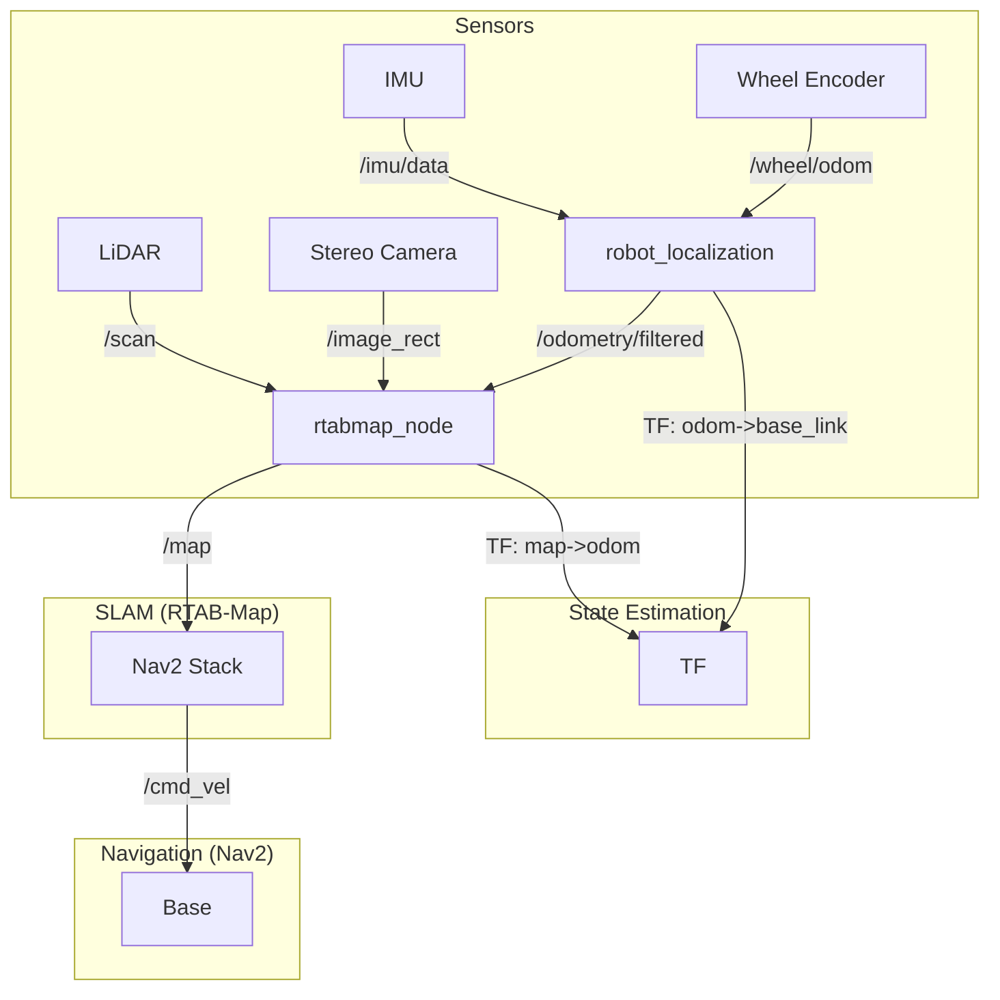

# 📅 开发日记模板 (YYYY-MM-DD)

> **作者**: [谢承旭]
> **日期**: 2025-01-24  
> **天气/状态**: [例如：晴 / 精神饱满]

---

## 🎯 1. 今日目标 (Objectives)

*   [x] **硬件驱动节点化**: 将 IMU、底盘、雷达、视觉进行 ROS2 节点化处理 (Ref: `docs/design/slam_fusion_roadmap.md`)
    *   [ ] **IMU 节点**: 封装 I2C 通信，发布 `/imu/data` (sensor_msgs/Imu)
    *   [x] **底盘节点**: 封装 I2C 通信，发布 `/wheel/odom` (nav_msgs/Odometry)，订阅 `/cmd_vel`
    *   [ ] **雷达节点**: 发布 `/scan` (sensor_msgs/LaserScan)
        * [x] 寻找雷达 SDK
        * [x] 熟悉雷达 SDK
        * [x] 基于雷达 SDK 发布节点
        * [ ] 验证与测试
            * [x] 编译测试 (Build Test)
            * [ ] 实机测试 (Hardware Test) 
    *   [ ] **视觉节点**: 发布 `/image_raw` (sensor_msgs/Image)
        * [x] 寻找视觉 SDK
        * [ ] 熟悉视觉 SDK
        * [ ] 基于视觉 SDK 发布节点
        * [ ] 验证与测试
            * [ ] 编译测试 (Build Test)
            * [ ] 实机测试 (Hardware Test) 
*   [ ] **SLAM 专项突破** (Ref: `docs/design/slam_fusion_roadmap.md`)
    *   [ ] **路线图规划**: 完成 SLAM 选型与 Roadmap 设计 (RTAB-Map vs Cartographer)
    *   [ ] **数据准备**: 验证 IMU (>100Hz)/LiDAR/双目 时间同步与 TF 树完整性
    *   [ ] **标定**: 确认 Camera-LiDAR-IMU 外参矩阵
    *   [ ] **方案验证 (离线)**: 录制 Rosbag，在 PC 端对比 RTAB-Map 与 Cartographer (重点评估建图质量与资源占用)
    *   [ ] **实车部署**: 选择最优方案部署至 RDK，并对接 Nav2
*   [ ] 初步配置 Nav2 导航栈以对接 SLAM
*   [ ] 激光雷达/视觉简易避障
*   [ ] 重新校验现有实现和原有架构设计

---

## 💻 2. 工作内容 (Work Log)

### 2.1 视觉节点 (Visual Node)
*   **实现细节**: 创建了 `camera_control` 功能包，用于封装 Orbbec 相机驱动。配置了 launch 文件以发布 `/image_raw` 话题，并进行了话题重映射。
*   **代码变更**:
    *   `src/execution/camera_control/package.xml`: 新增功能包配置
    *   `src/execution/camera_control/launch/camera_node.launch.py`: 新增启动文件，集成 `orbbec_camera` 并重映射话题

### 2.2 调试与测试
*   **测试场景**: (例如：在光滑地面直线行驶 2 米)
*   **观察结果**: (例如：向左偏航 5 度)
*   **调整参数**: `Kp` 从 1.0 -> 1.2

---

## 🐛 3. 问题与解决方案 (Issues & Solutions)

### 🔴 问题 1: [简短描述]
*   **现象**: (报错信息或异常行为)
*   **原因分析**: ...
*   **解决方案**: ...
*   **状态**: ✅ 已解决 / ⏳ 跟进中

### 🟠 问题 2: ...

---

## 💡 4. 心得与备忘 (Notes & Ideas)

- **AI 项目硬件文档规范**：涉及到硬件的 AI 项目，务必将所有相关资料放在项目 `docs` 目录下以供 AI 参考。

    - **背景**：硬件配置信息分散，导致 AI 和新成员难以快速理解物理基础。
    - **决策**：所有硬件项目必须在 `docs/dev_instruction/` 下维护 `hardware_config.md`。
    - **内容规范**：包含核心计算单元、执行器、传感器、Pinout、电源管理等。
    - **目的**：建立单一数据源 (SSOT)，降低门槛，提高 AI 辅助效率。

---

## 📚 5. 学习计划 (Learning Plan)

基于您在 `/app/jic_competiion` 项目中的 `docs/design/slam_fusion_roadmap.md` 路线图，以及当前的代码结构，为您梳理 **ROS 2 + RTAB-Map (双目+LiDAR+IMU) + Nav2** 集成的核心知识点。这些内容直接对应您“Day 3”和“Day 4”的开发目标。

### 1. 核心坐标系与 TF 树 (TF Tree)
这是所有 SLAM 和导航的基础。RTAB-Map 和 Nav2 极其依赖完整的 TF 树。

*   **必须存在的 TF 链**:
    `map` -> `odom` -> `base_link` -> `[sensor_links]`
*   **各部分职责**:
    *   **`map` -> `odom`**: 由 **RTAB-Map** 发布。它负责修正累积误差（回环检测），当发现之前到过的地方时，会“跳变”这个 TF 来对齐地图。
    *   **`odom` -> `base_link`**: 由 **里程计源** 发布。通常是 `robot_localization` (EKF) 融合轮式里程计和 IMU 后发布。此变换必须是平滑、连续的。
    *   **`base_link` -> `sensor_links`**: 静态变换 (Static TF)。通常在 URDF (`.xacro`) 中定义，或使用 `static_transform_publisher` 发布。需精准标定（尤其是相机和 LiDAR 的相对位置）。

### 2. 多传感器融合策略 (Sensor Fusion Strategy)
针对您的 RDK X5 + 双目 + 2D LiDAR + IMU 硬件配置，推荐的融合架构如下：

#### A. 里程计层 (Odometry) - 高频、平滑
不要直接使用 RTAB-Map 做里程计（虽然它可以），建议使用 **`robot_localization`** 包。
*   **输入**:
    *   **轮式里程计 (Wheel Odom)**: 提供 x, y 速度和 yaw 速度。
    *   **IMU**: 提供角速度 (Gyro) 和加速度 (Accel)。
*   **输出**:
    *   发布 `odom` -> `base_link` 的 TF。
    *   发布 `/odometry/filtered` 话题。
*   **配置要点**:
    *   IMU 需配置为 `differential: false` (如果是绝对朝向) 或 `true` (如果只用角速度)。
    *   确保所有传感器的时间戳 (`header.stamp`) 同步。

#### B. 建图与定位层 (SLAM) - 低频、全局
**RTAB-Map** 负责接收上述里程计，并结合视觉和激光雷达进行闭环。
*   **输入模式**: `RGB-D` (双目生成的深度) + `Scan` (2D LiDAR)。
*   **关键参数 (`rtabmap_ros`)**:
    *   `subscribe_stereo`: `true` (订阅双目图像)。
    *   `subscribe_scan`: `true` (订阅 2D 激光雷达)。
    *   `subscribe_odom_info`: `true` (如果使用外部里程计)。
    *   `odom_frame_id`: `"odom"` (使用 robot_localization 的输出)。
    *   `frame_id`: `"base_link"`。
    *   `Reg/Strategy`: `2` (Vis + Icp)。这意味着同时利用视觉特征和激光雷达匹配来计算约束，利用了双目的丰富信息和 LiDAR 的几何精度。

### 3. RTAB-Map 与 Nav2 的对接 (Integration)
Nav2 需要地图和定位信息来规划路径。

*   **地图源 (Map Server)**:
    *   通常 Nav2 使用 `map_server` 加载静态 `.yaml` 地图。
    *   **但在 SLAM 模式下**，RTAB-Map 会实时发布 `/map` 话题。Nav2 的 Costmap 需要配置为订阅此 `/map` 话题，而不是通过 `map_server` 加载。
    *   **知识点**: RTAB-Map 输出的是 `OccupancyGrid` 格式的 2D 栅格地图，天然兼容 Nav2。

*   **代价地图 (Costmap)**:
    *   **Global Costmap**: 设置 `static_layer` 订阅 `/map`。
    *   **Local Costmap**: 使用 `rolling_window: true`，结合 `/scan` (实时避障) 和 `/odom`。

### 4. RDK X5 平台特定优化 (Optimization for RDK X5)
由于是在嵌入式平台上运行，资源管理至关重要。

*   **计算卸载**:
    *   **深度计算**: 尽量使用地瓜机器人提供的硬件加速节点（如果有）来从双目图像计算深度，而不是让 RTAB-Map 在 CPU 上用 `stereo_image_proc` 算。
*   **RTAB-Map 参数调优**:
    *   `Rtabmap/DetectionRate`: 降低到 1Hz 或 2Hz（默认 1Hz）。建图不需要太快，高频会占满 CPU。
    *   `Vis/MaxFeatures`: 限制视觉特征点数量（例如 500-1000），防止耗尽内存。
    *   `Grid/3D`: `false` (如果只做平面导航，关闭 3D 点云处理以节省资源)。

### 5. 调试排错清单 (Troubleshooting Checklist)
*   **地图重影**: 通常是 `odom` 漂移过大，或者外参标定（TF）不准。
*   **Nav2 路径规划失败**: 检查 `/map` 是否有未知的黑色区域挡住了路，或者膨胀半径 (Inflation Radius) 设置过大导致狭窄通道堵死。
*   **回环检测失效**: 检查环境光照（双目依赖纹理）和是否在长走廊（几何特征单一，LiDAR 易退化）。

### 总结架构图

        
          
结合您的 `dev_diary` 和 `roadmap`，要完成 **“基于 RDK X5 的双目+2D LiDAR+IMU 融合 SLAM 及 Nav2 对接”**，您需要掌握以下核心知识点。我将其按 **“数据流向”** 整理为 4 个层级，方便您逐个击破：

### 1. 基础层：坐标系与传感器 (The Foundation)
这是 SLAM 成功的基石，80% 的建图失败都源于此。
*   **TF 树 (Transform Tree)**:
    *   **必须理解的链条**: `map` -> `odom` -> `base_link` -> `[imu_link/lidar_link/camera_link]`。
    *   **静态 TF**: 如何在 URDF (`.xacro`) 中精准定义传感器相对于底盘中心的 XYZ 和 RPY（外参）。
*   **传感器同步**:
    *   **时间戳对齐**: 理解 `header.stamp` 的重要性。多传感器融合要求数据基于同一时钟源（系统时间）。
*   **双目视觉基础**:
    *   **视差图转深度图**: 理解双目相机如何生成深度信息（RTAB-Map 需要 `RGB` + `Depth` 或 `Stereo Images` 输入）。

### 2. 状态估计层：里程计 (Odometry)
RDK X5 算力有限，推荐将“里程计”与“建图”解耦。
*   **EKF 融合 (`robot_localization`)**:
    *   **知识点**: 如何配置 Kalman Filter 融合 **轮速计 (Wheel Odom)** 和 **IMU**。
    *   **输入**: 轮速提供平移速度 ($v_x, v_y$)，IMU 提供角速度 ($\omega_z$) 和瞬时加速度。
    *   **输出**: 高频、平滑的 `odom` -> `base_link` 变换（Odom TF）。
    *   **避坑**: 轮速计通常随时间漂移，IMU 虽准但有零偏，EKF 能互补但不能消除长期累积误差（这需要 SLAM 层解决）。

### 3. 算法层：RTAB-Map 融合 (SLAM)
这是核心难点，利用视觉和雷达的互补性。
*   **多传感器输入配置**:
    *   **Visual**: 用于**回环检测 (Loop Closure)**。在特征丰富的环境（如办公室）防止迷路。
    *   **LiDAR (2D)**: 用于**几何约束 (ICP)** 和 **栅格地图生成**。在光照变化大或白墙环境提供稳定性。
*   **RTAB-Map 关键参数**:
    *   `Reg/Strategy`: 设为 `2` (Visual + ICP)。这是融合的关键，先用视觉做粗匹配，再用雷达做精匹配。
    *   `Grid/FromDepth`: 设为 `false`。**强制使用 2D LiDAR 生成栅格地图**，比用双目深度图投影更准、更省算力（RDK X5 必选配置）。
*   **输出**:
    *   低频修正的 `map` -> `odom` 变换（Map TF）。
    *   标准 `/map` (OccupancyGrid) 话题，供 Nav2 使用。

### 4. 应用层：Nav2 导航 (Navigation)
*   **Costmap (代价地图)**:
    *   **Global Costmap**: 配置 `static_layer` 订阅 SLAM 发布的 `/map`。
    *   **Local Costmap**: 配置 `obstacle_layer` 订阅实时 `/scan`，用于动态避障。
*   **生命周期管理 (Lifecycle)**:
    *   Nav2 的节点需要按顺序启动 (Configure -> Activate)。理解 `Lifecycle Manager` 如何控制节点状态。
*   **参数配置**:
    *   `robot_radius` / `footprint`: 根据小车实际尺寸设置，直接影响避障效果。

### 🚀 学习路径建议
1.  **先搞定 TF**: 只要 `ros2 run tf2_tools view_frames` 生成的树不断裂、结构对，就成功了一半。
2.  **跑通 EKF**: 确保不运行 SLAM 时，推着小车走，Rviz 里的 `base_link` 移动平滑且比例正确。
3.  **最后上 SLAM**: 在前两步稳固的基础上，启动 RTAB-Map 只是一个 Launch 文件的事。

---

**是否需要我为您生成一份 `robot_localization` 的配置文件模板 (`ekf.yaml`)，作为 "Day 2" 的起步？**

---

## 🚀 6. 明日计划 (Next Steps)

*   [ ] **硬件驱动节点化 (Hardware Drivers)**
    *   [ ] **IMU 节点**: 封装 I2C 通信，发布 `/imu/data` (sensor_msgs/Imu)
    *   [ ] **雷达节点**: 发布 `/scan` (sensor_msgs/LaserScan)
    *   [ ] **视觉节点**: 发布 `/image_raw` (sensor_msgs/Image)
*   [ ] **SLAM 专项突破 (SLAM Fusion)**
    *   [ ] **数据准备**: 验证 IMU (>100Hz)/LiDAR/双目 时间同步与 TF 树完整性
    *   [ ] **标定**: 确认 Camera-LiDAR-IMU 外参矩阵
    *   [ ] **方案验证 (离线)**: 录制 Rosbag，在 PC 端对比 RTAB-Map 与 Cartographer (重点评估建图质量与资源占用)
    *   [ ] **实车部署**: 选择最优方案部署至 RDK，并对接 Nav2
*   [ ] **导航与应用 (Navigation)**
    *   [ ] 初步配置 Nav2 导航栈以对接 SLAM
    *   [ ] 激光雷达/视觉简易避障
*   [ ] **架构复盘**: 重新校验现有实现和原有架构设计

