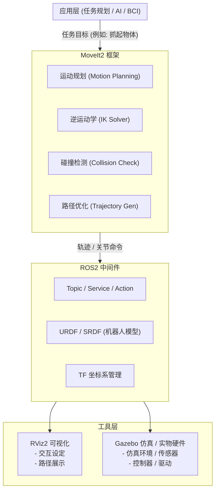

# 1. 定项目方向

## 近期日程（SLAM H4，2026-04-09 ~ 2026-04-15）

### 里程碑（M-SLAM-H4）
- 目标：7 天内完成 `/scan + /odom + TF -> /map` 最小闭环并形成可交付记录。
- 完成判据：Task 1~7 全部满足验收标准，产出物齐全。

### 7 天排期（含优先级）
- 2026-04-09（P0）：Task 1 雷达链路打通。
- 2026-04-10（P0）：Task 2 TF 静态链路建立。
- 2026-04-11（P0）：Task 3 最简里程计接入。
- 2026-04-12（P0）：Task 4 SLAM 建图首次跑通。
- 2026-04-13（P1）：Task 5 地图保存与重载验证。
- 2026-04-14（P1）：Task 6 最小评测与稳定性基线。
- 2026-04-15（P1）：Task 7 故障定位演练与文档收口。

### 每日 Todo（执行窗口）
- Day 1：启动雷达并记录 `/scan` 频率、`frame_id` 与 RViz 截图。
- Day 2：补齐 `base_link -> laser_frame`，保存 TF 树截图。
- Day 3：接入最简 odom，输出 `/odom` 记录与验证说明。
- Day 4：跑通 `slam_toolbox`，确认 `/map` 与 `map -> odom`。
- Day 5：保存并重载地图，完成一次重定位演示记录。
- Day 6：完成一次轨迹评估与 10 次运行稳定性统计。
- Day 7：做 1~2 个故障定位演练并整理最终交付包。

### 模块视图（Owner: 程序）
- 驱动模块（P0）：Task 1，Task 2。
- 里程计模块（P0）：Task 3。
- SLAM 核心模块（P0）：Task 4。
- 地图服务模块（P1）：Task 5。
- 评测与稳定性模块（P1）：Task 6。
- 文档与复盘模块（P1）：Task 7。

### 风险与依赖
- 依赖：雷达驱动稳定、TF 命名统一、odom 精度可用。
- 风险：串口抖动、TF 断链、参数不收敛导致建图漂移。
- 预案：每日预留 1 小时用于回归与参数回退。

确定为 机械臂搬运物品的方向 ，引入模块化机械臂、多模态控制两个创新点 [[项目简介]]

# 2. 报名参与比赛

到官网进行报名参与比赛

# 3. 寻找相近案例

寻找相近的案例，分析其架构、优缺点

# 4. 制定顶层架构

利用 [[自上而下]] 设计思想，根据项目说明制定顶层架构 

![[团队仓库/1. STA 知识/成员项目/嘉立创项目/项目绘图/架构绘图/1. 功能架构.md#^group=sz8VHQQCQMlIJQZ3oGYVY]]

# 5. 确定各部需求

- 机械需求：机械臂、底盘、整车结构 （==两两之间进行模块化设计==）

- 电路需求：机械臂驱动及通信、底盘驱动及通信、外设驱动及通信

- 程序需求：ROS 框架、SLAM 场景重建、路径规划、识别抓取（多模态控制、接口模块设计、）

# 6. 选择模仿目标
考虑以下问题选择合适的模仿项目
	
- **功能契合度** — 项目实现的核心功能（抓取、移动、末端模块化、导航等）要跟你要做的 MVP 高度重合。
	
- **开源与可得性** — 代码、硬件图、固件、BOM、3D 模型等资料是否公开且易获取。
	
- **实现复杂度** — 难度要可控（别选过于工业级或商业闭源的超复杂系统），优先选教育/爱好者级或研究级项目。
	
- **硬件可替代性** — 使用的传感器、电机、驱动板是否有容易替代或购买的同类件。
	
- **文档质量** — 有无系统 README、接线图、接口说明、编译与烧录步骤，文档越完整越省事。
	
- **社区与维护度** — 是否有活跃社区、issue/PR 记录、可问答的作者或用户群体，遇到坑容易有人帮。
	
- **技术栈相容性** — 软件/通信协议（ROS/非ROS、UART/CAN/ROS2）、开发语言与你团队熟悉度匹配。
	
- **许可证与商业风险** — 许可类型允许逆向/改造与展示（避开限制性的商业闭源许可）。
	

**第一考虑**：[Hiwonder JetRover JETSON Robot Car with AI Vision Robotic Arm, Support](https://www.hiwonder.com/products/jetrover?variant=41198996422743&srsltid=AfmBOoo1XfRa4mMMM77HP5bKsbRC_WgrbP4SaPs85fghlCVQGpeLoHs4&utm_source=chatgpt.com)

>**理由**：该方案其基本上一个平台涵盖了我们所有想要做的方案，但是缺点就是实体机太贵了。实验室没有经费去承担

**第二考虑**：事实上利用线性组成的思想，我们可以分别学习以下开源项目，然后将其进行整合

| 模块        | 可参考开源项目/仓库                          | 作用/特点                                                 | 与项目阶段对应     |
| --------- | ----------------------------------- | ----------------------------------------------------- | ----------- |
| 机械臂控制     | **D-Robotics / rdk_LeRobot_tools**  | 提供伺服电机标定、遥操作、动作采集与复现，可作为关节控制与标定的参考                    | 阶段 1：基本运动控制 |
|           | **Flexiv RDK SDK**                  | 成熟的机械臂 API，区分实时/非实时接口，适合作为通信与 API 结构设计参考              | 阶段 1、2      |
| 视觉感知      | **D-Robotics / rdk_model_zoo**      | 集成 YOLO/分类/分割模型，可直接在 RDK 部署，适合做目标检测与视觉输入              | 阶段 2：视觉抓取   |
|           | **RDK SDK 摄像头示例**                   | 提供摄像头接入与视频流读取样例，可结合 OpenCV 完成标定与目标识别前处理               | 阶段 2        |
| SLAM & 导航 | **D-Robotics / ROS2 示例 (TROS.Bot)** | 演示如何在 RDK 上运行 ROS2 节点，可移植 slam_toolbox / Nav2 实现导航与避障 | 阶段 3：路径规划   |
|           | 社区移植案例（TurtleBot3 on RDK）           | 借鉴 TurtleBot3 的运动学模型与 ROS 节点，移植到 RDK 运行               | 阶段 3        |
| 底盘运动学     | **RDK 基础驱动示例**                      | 提供 GPIO / UART / CAN / PWM 的调用样例，可改造成电机控制接口           | 阶段 3        |
|           | TurtleBot3 / JetRover 控制包           | 作为参考，替换底层驱动后可运行在 RDK 上，快速构建底盘运动学模型                    | 阶段 3        |
| 系统集成与扩展   | **Viam RDK (Go SDK)**               | 提供模块化接口设计（arm/base/camera/vision），可借鉴其任务管理与扩展思路       | 阶段 4–6      |
|           | **RDK ↔ ROS 桥接示例**                  | 展示如何把 RDK SDK 接口映射到 ROS topic/service，利于多模块集成         | 阶段 4–6      |

# 7. 定下实现思路

- 先在仿真环境里跑通所有模块（底盘运动 +机械臂抓取 + SLAM +导航 +视觉感知）
    
- 分模块拆开看代码：底盘控制、机械臂控制、SLAM 映射、导航规划、末端抓取
    
- 比较这些模块的接口／通信方式（ROS topic / action / service / TF）
    
- 再替换／增加你们的末端标准（夹爪／模块化工具）看看要改哪些部分
    
- 最后如果可能，把仿真迁移到实体硬件（你们自己做底盘／机械臂／传感器）验证

# 8. 规划时间线

- **并行开发**：将能力拆成独立可交付的模块（机械臂控制 / 视觉感知 / 底盘 / 模块化接口 / 系统调度），每个模块独立迭代与验证。
    
- **标准接口**：所有模块通过约定的 ROS topic/action/service 或简单 RPC（UART/CAN/REST）互联，先在仿真中验证接口契约。
    
- **频繁集成**：每 3 周做一次“集成冲刺/验收”，尽早发现接口与时序问题。
    
- **渐进式验收（MVP）**：优先实现最小可运行样例（例如：底盘 + 固定臂的抓取），再扩展功能。

<b>表：任务安排简表</b>

| 周次      | 主要目标             | A（电路）            | B（电路+程序）           | C（程序+机械）          | D（机械）                | 自学内容                                |
| ------- | ---------------- | ---------------- | ------------------ | ----------------- | -------------------- | ----------------------------------- |
| 周0（准备周） | 环境/资料/元件准备       | 整理电路需求，开发环境搭建    | RDK/视觉 demo 环境搭建   | 底盘与机械臂选型，算法接口确认   | 草绘机械臂与末端模块方案，准备打印    | A/B: EDA 基础，RDK SDK；C/D: 运动学与 3D 打印 |
| 第1周     | MVP 定义 & Demo 验证 | 底盘电机接口草图，电源需求确认  | 简单目标检测 demo，输出坐标   | 底盘运动/视觉结果与机械臂接口适配 | 打印小臂 mockup，测试接口手感   | A: 电机控制基础；B: 简单检测方法；C/D: 机械自由度设计    |
| 第2周     | 原型拼装（快速验证版）      | 电源 + 电机控制电路面包板验证 | 相机标定 & 像素→坐标映射     | 整合底盘、视觉与机械 demo   | 打印小臂 + 夹爪雏形，人工辅助抓取   | B: 轻量 CNN；C: 坐标变换；D: 装配调试技巧         |
| 第3周     | PCB/算法初版 & 协同测试  | 电路原理图草案，PCB 初版设计 | 视觉抓取闭环（检测→接近→停止）   | 协助闭环测试，检查机械接口适配性  | 可插拔末端模块初版（接口 + 电气预留） | A: PCB 软件操作；B: PID 基础；D: 模块化接口标准    |
| 第4周     | PCB 到货调试 & 初步集成  | 上板调试（电源/电机/通信）   | 加入 PID 控制，提升鲁棒性    | 联调底盘+机械臂动作与视觉抓取   | 优化夹爪机械结构，保证稳定抓取      | A: 上板调试技巧；B: 控制闭环；C/D: 闭环测试经验       |
| 第5周     | 模块化末端实现 & 策略优化   | 模块 ID 识别电路设计与验证  | 依据 ID 自动切换策略，提升成功率 | 集成多末端测试，检验算法适配    | 制作多末端模块（夹爪/吸盘），快速切换  | A: 模块识别电路；B: 策略优化；C: 集成验证；D: 快速切换方法 |
| 第6周     | 系统闭环优化 & 连续运行测试  | PCB 稳定运行，处理电路异常  | 抓取放置闭环调优，保证稳定      | 协同调试，运行连续任务测试     | 优化结构强度、美观和布线         | 全体: 闭环调优、系统稳定性优化                    |
| 第7周     | 集成调试 & 稳定化       | 支持集成调试，电路问题快速定位  | 算法性能优化，稳定率测试       | 连续运行数据收集，辅助系统验证   | 优化机械精度，末端可靠性         | 全体: 集成测试与问题追踪                       |
| 第8周     | 最终集成 & 演示准备      | 输出电路文档与固件代码      | 输出算法文档与 README     | 演示流程调试，协助答辩准备     | 最终机械装配，保证演示稳定        | 全体: 演示彩排、视频记录、打包提交                  |

##  **阶段 1：机械臂操纵（3 周）**

- **目标**：实现机械臂的基本运动控制（关节转动、轨迹跟随）。
    
- **任务**：
    
    - 搭建 MCU 与 RDK 的通讯接口（CAN/UART）。
        
    - 完成关节 PID 控制和角度反馈验证。
        
    - 简单运动测试（预设动作）。
        
- **输出**：机械臂可接受指令并完成重复性动作。

### 1. 技术熟悉（1周）

### 2. 仿真阶段（2~3 周）

目标：在虚拟环境中把“关节控制—反馈—轨迹执行”的完整流程跑通。

思路：先在 Windows 环境下开发并且用 Webot 仿真，然后导出 ROS2 可用的数据放入 ROS2 中仿真校验，这样就算扛着电脑离开实验室环境也能够继续开发和调试。

**工具选择**

- **Webot**：Windows 下的优秀仿真平台，便于开发调试
    
- **ROS2 + Gazebo 模块+MoveIt 模块**：可以加载机械臂的 URDF 模型；提供关节控制接口、运动规划和可视化。
	

图：Windows 上仿真步骤

<b>图：ROS2 上仿真步骤</b>

**步骤**

1. **获取机械臂模型**
    
    - 如果是开源机械臂（如 myCobot、uArm、xArm），一般都有 URDF 或者 ROS 包。
        
    - 如果没有，就需要自己写 URDF 或者用 SolidWorks/Blender 导出。
        
2. **加载仿真环境**
    
    - 在 Gazebo 或 Webots 里加载机械臂 URDF。
        
    - 连接 ROS 控制器（ros_control + joint_state_publisher）。
        
3. **关节控制接口**
    
    - 使用 `rostopic pub /jointX_position_controller/command` 来下发目标角度。
        
    - 使用 `rostopic echo /joint_states` 来读取反馈角度。
        
4. **PID 调参（虚拟验证）**
    
    - ros_control 支持 PID 参数设置，可以先在仿真里调到响应平稳、不震荡。
        
    - 记录参数，未来迁移到 MCU 上参考。
        
5. **预设动作测试**
    
    - 写一个 ROS node（Python/Cpp）发布几个预设角度轨迹。
        
    - 观察机械臂是否能完成“抬起、放下、抓取”之类的简单动作。
        

**输出**

- 一份可运行的仿真 Demo（launch 一下就能执行预设动作）。
    
- 一份 PID 参数初稿。
    

---

## **阶段 2：机械臂视觉抓取（4 周）**

- **目标**：实现机械臂基于视觉的物体识别与抓取。
    
- **任务**：
    
    - 接入摄像头 + 感知模块（OpenCV/轻量AI）。
        
    - 完成像素坐标 → 机械臂坐标系的标定。
        
    - 实现简单目标检测（颜色/形状）。
        
    - 机械臂执行抓取（吸盘/夹爪）。
        
- **输出**：能够识别并抓取静态桌面上的目标。
    

---

---

### 1. 实物阶段（3周）

当虚拟环境跑通后，再转向 MCU + RDK（硬件）：

1. **MCU ↔ RDK 通信接口**
    
    - 先写一个简单的 CAN/UART 通信协议（如：发送目标角度，返回当前角度）。
        
    - 在 RDK 上模拟下发一个角度命令，MCU 反馈角度。
        
2. **MCU 上的关节控制**
    
    - 实现 PID 控制：目标角度 → 驱动 PWM → 编码器反馈角度 → PID 调整。
        
    - 一开始只做单关节循环，确认能稳定定位。
        
3. **逐步增加关节**
    
    - 先单关节，再两关节联动，最后整个机械臂。
        
    - 保持和仿真接口一致，这样 ROS node 不用改太多。
        
4. **预设动作复现**
    
    - 把仿真里的预设轨迹，下发到实体机械臂，看是否动作一致。
        
	

## **阶段 3：移动平台路径规划（3 周）**

### 1. 底盘设计

### 2. 底盘测试

### 3. 底盘优化

- **目标**：实现移动底盘的自主移动与避障。
    
- **任务**：
    
    - 底盘运动学建模与驱动控制验证。
        
    - 实现简化的路径规划（A* 或 RRT-lite）。
        
    - 增加超声波/激光雷达/视觉简易避障。
        
- **输出**：底盘可从起点移动到目标区域并避开简单障碍物。
    

---

## **阶段 4：机械臂 + 移动平台协作搬运（3 周）**

- **目标**：将视觉抓取与路径规划集成，实现搬运任务。
    
- **任务**：
    
    - 底盘移动到目标点 → 机械臂抓取 → 底盘运送 → 机械臂放置。
        
    - 定义任务管理器的流程控制。
        
    - 进行多次集成调试。
        
- **输出**：系统可完成搬运流程的 Demo（单一物体搬运）。
    

---

## **阶段 5：机械臂接口模块化（2 周）**

- **目标**：实现末端执行器的模块化插拔与自动识别。
    
- **任务**：
    
    - 设计模块 ID 电路（电阻 ID / 插针检测）。
        
    - MCU 实现自动识别与参数上报。
        
    - RDK 任务管理器自动切换抓取策略。
        
- **输出**：可在不改代码的情况下更换夹爪/吸盘等末端模块。
    

---

## **阶段 6：机械臂操作多模态化（3 周，扩展阶段）**

- **目标**：加入 BCI/MR/语义接口，支持多模态交互。
    
- **任务**：
    
    - 接入 MR 眼镜（Unity/SDK）与 HRI 接口。
        
    - 接入 BCI 信号或语义解析 SDK。
        
    - 定义多模态输入与任务映射规则。
        
- **输出**：可通过 MR/BCI/语音等方式下达任务指令，实现“脑-语义-MR三元交互”。